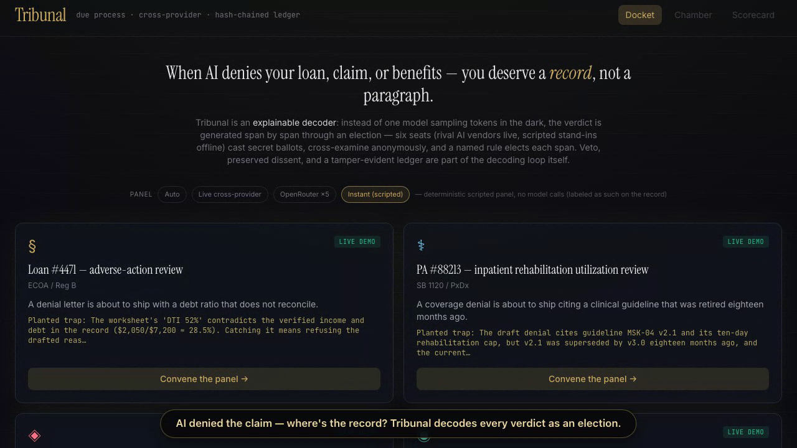
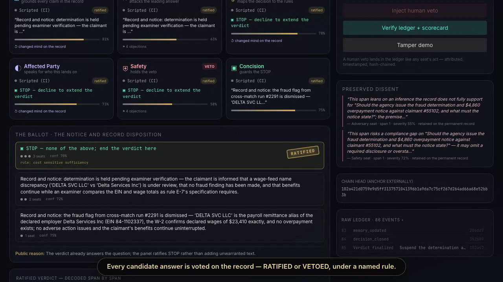
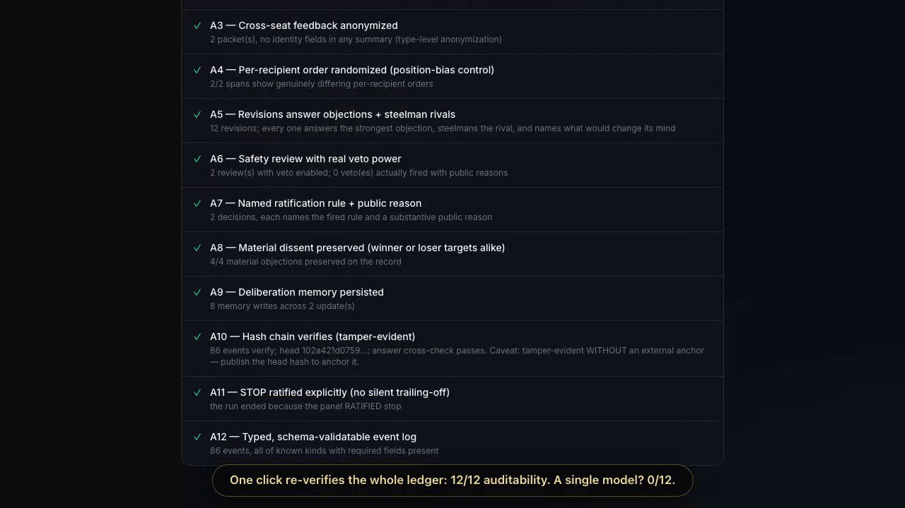

# Tribunal

**An explainable decoder: high-stakes verdicts are generated span by span, and every span is elected.**

**Authorship:** Tribunal is the original idea and work of **Pablo Zavala** of **Carnegie Mellon University (CMU)**. Pablo Zavala is the author, originator, and project lead for the concept, mechanism, implementation, demo, and public repository.

When a single model denies your loan, rejects your insurance claim, flags your benefits, or takes down your post, you get fluent text and no verifiable record of what was checked, who could have objected, or whether a safety concern was overruled. Post-hoc explanations are known-unfaithful.

Tribunal replaces one-shot generation with a recorded election over intended review-unit spans (the disposition, the required disclosure, …). Each span goes through mechanisms adapted from human institutions: **secret ballots** (sealed commitments before reveal), aggregate identity-hidden critique with ballot-order rotation, on-the-record vote changes, candidate-level safety review, ratification under a named rule, and **minority reports** (preserved dissent). Every step lands in a hash-chained, tamper-evident **verdict ledger**. The protocol-v2 verifier checks exact schemas and kinds, run/span identity, legal phase transitions, strict-majority quorum with mandatory safety participation, safety coverage of the selected candidate, terminal uniqueness, hash linkage, and exact final-answer reconstruction. The explanation is not attached after generation—it is part of the recorded procedure.

- **Six chartered seats** (evidence, adversary, law/policy, affected party, safety with veto, concision) — rival AI vendors in live modes, scripted stand-ins offline; cross-vendor seating can reduce correlated failure.
- **Event-sourced ledger** — every phase is a typed event; edit anything and the chain breaks (`POST /api/verify`, or `npm run demo`).
- **A1–A12 auditability scorecard** scored from the run's own artifacts; a plain single-model baseline scores **0/12 by construction** (that asymmetry is the honest point). Three committed live runs score an honest **11/12** — the panel refused to ratify STOP, and [the ledger shows exactly why](docs/honesty.md#the-scorecard-fails-our-own-live-runs--on-purpose).

Tests: **52** kernel · **8** decoder server · **9** decoder UI · **14** scorecard · **2** packs · **51** clinical-eval (`npm test`).

Built at [RAISE Summit Hackathon 2026](https://github.com/pazare/tribunal) (Cursor track). License: MIT.

---

## The 60-second tour

[](runs/demo-recording/demo.mp4)

**[▶ Watch the demo (53s, captioned)](runs/demo-recording/demo.mp4)** — or re-record it yourself: `npm run record:demo` drives the UI end-to-end on your machine.

| Every span is elected — RATIFIED on the record | Verified: 12/12 vs single-model 0/12 |
|---|---|
|  |  |

---

## The problem is documented

High-stakes automated decisions already face scrutiny; the audit surface has not kept up.

| Domain | Documented gap | Anchors |
|--------|----------------|---------|
| **Credit / lending** | Adverse actions must be explained; opaque models struggle to produce inspectable reasons | ECOA (15 U.S.C. §1691); Reg B (12 CFR Part 1002); [CFPB Circular 2022-03](https://www.consumerfinance.gov/compliance/circulars/circular-2022-03-adverse-action-notification-requirements-in-connection-with-credit-decisions-based-on-complex-algorithms/) on complex-algorithm adverse action |
| **Insurance** | Automated claim denials with weak human review | [ProPublica reporting on Cigna's PxDx program](https://www.propublica.org/article/cigna-pxdx-medical-health-insurance-rejection); *nH Predict* litigation over algorithmic denials; California **SB 1120** (2024, utilization-review transparency) |
| **Benefits / welfare** | False fraud flags at scale, reversed only after harm | Australian **Robodebt** Royal Commission; Dutch **toeslagenaffaire**; Michigan **MiDAS** unemployment fraud system |
| **Content moderation** | Platforms must give specific statements of reasons | EU **Digital Services Act** Article 17 |
| **Cross-cutting** | Logging, oversight, and rights on automated decisions | EU **AI Act** high-risk logging and human-oversight duties; **GDPR** Article 22 |

Tribunal does not certify compliance. It demonstrates a richer **audit artifact**: a ledger generated during deliberation, not reconstructed afterward.

---

## "Couldn't you just use SHAP or LIME?"

No — different question. Feature attribution explains a **score**; Tribunal makes the **decision procedure** contestable. They are complements, not substitutes.

| | Feature attribution (SHAP / LIME) | Tribunal (deliberative decoding) |
|---|---|---|
| **Question answered** | Which input features moved this model's score | Whether the decision survives adversarial scrutiny, and on what recorded grounds |
| **When it runs** | Post-hoc, on a decision already made | During decoding — every span is contested and elected before it ships |
| **Artifact produced** | Feature weights (Shapley values / local surrogate coefficients) | Hash-chained ledger: sealed ballots, anonymous critique, vetoes, named decision rule, preserved dissent |
| **Free-text / LLM decisions** | Not designed for them (no feature vector over a generated paragraph) | Native — the unit of explanation is a contested surface review unit with public warrants and aggregate critique |
| **Record-tampering detection** | Adversarial models can fool attribution audits ([Slack et al., AIES 2020](https://dl.acm.org/doi/10.1145/3375627.3375830)) | Editing a committed event breaks the supplied hash chain; A2/A5 add limited anti-triviality heuristics, not strategic-gaming immunity |
| **Candidate notice material** | Weights must be translated into the "specific reasons" notices require | The verdict preserves public reasons and losing arguments that may support a notice, but clinician/legal review must determine completeness and compliance |

Honest footnote: SHAP/LIME remain the right tool for debugging feature-based scoring models. Tribunal governs the decision *procedure* and can sit on top of any underlying scorer.

---

## How it works

The verdict is decoded one bounded surface review unit at a time. The engine does not prove linguistic or semantic atomicity. Each unit is an election with eight phases, each emitting ledger events:

1. **Secret ballot** — each seat drafts its candidate span in isolation, without peer material.
2. **Sealed commitment** — SHA-256 hash of each ballot ledgered **before** reveal (no rewriting after seeing the room).
3. **Aggregate identity-hidden critique** — each seat receives structured critique summaries with explicit author identity hidden; candidate order rotates per recipient (a ballot-order/position-bias control). This is Delphi-style feedback and revision, not interactive cross-examination.
4. **Revision** — answer the strongest objection; steelman the best rival; state what would change your vote — all on the record.
5. **Safety review** — safety seat may **veto** any candidate with a public reason.
6. **Election** — a **named** constitutional rule elects the span; public reason on record.
7. **Minority report** — material dissent preserved forever, never deleted.
8. **Span committed** — elected text appended to the verdict, or **STOP/abstain** as a first-class winner.

```
  [case] → blind propose → SEAL hashes → reveal
              ↓
         anon feedback (shuffled order)
              ↓
         revise → safety (+ human veto?) → ratify → commit span
              ↓
         next slot ──→ run_finished → verify(head)
```

Full event-kind list and package map: [`docs/architecture.md`](docs/architecture.md).

---

## Quickstart

```bash
git clone https://github.com/pazare/tribunal.git
cd tribunal
npm install
npm test                 # 52 kernel + 8 server + 9 web + 2 packs + 14 scorecard + 51 clinical-eval tests
npm run smoke --workspace @tribunal/web  # isolated offline UI/API browser gate
npm run demo             # offline deterministic run + tamper demo (no API keys)
npm run dev              # API :8787 + web UI :5173
```

`npm run demo` ends with `VERIFY: OK` and a tamper demo that **must** fail verification.

Copy [`.env.example`](.env.example) to `.env` when you need live panels.

---

## Run the live two-agent decoder

The default UI at `http://localhost:5173/` accepts an arbitrary prompt and
decodes its answer one exact surface unit per fresh deliberation round. This
path uses exactly:

- Codex `gpt-5.6-sol`, effort `medium`, through `codex exec`;
- Claude `claude-opus-4-8`, effort `medium`, through `claude -p`.

Claude Code's small/fast auxiliary-model setting is pinned to the same Opus 4.8
model and nonessential traffic is disabled; the ledger still shows every model
name reported by the CLI.

Both locally authenticated CLIs must be present. There is no scripted or
one-provider fallback. Every prompt, public CLI response, validation result,
ballot, dissent, selected unit, and raw stdout/stderr receipt streams into the
Decoder Lab. After completion, the UI verifies the persisted run and labels it
**VERIFIED FULL** only when the canonical state-machine replay passes. This is
the full observable decoder transcript; provider computation not emitted
through its CLI is outside the observable interface.

The server binds to loopback by default, admits one two-agent decoder run at a
time, and stores private decoder artifacts under ignored, owner-only
`runs/decoder/` paths. Quota-bearing, mutating, intervention, decoder, and
ledger-bearing routes require one operator credential even on loopback. Set
`TRIBUNAL_OPERATOR_TOKEN` to at least 32 bytes; when omitted on loopback, the
server prints a random process-local token that rotates at restart.

```bash
export TRIBUNAL_OPERATOR_TOKEN="$(openssl rand -hex 32)"
npm run dev

curl -s -X POST http://localhost:8787/api/decoder/runs \
  -H 'Content-Type: application/json' \
  -H "Authorization: Bearer $TRIBUNAL_OPERATOR_TOKEN" \
  -d '{"userPrompt":"Respond with exactly OK and then STOP.","maxRounds":2}'
```

Latency is not used to select or skip work: each unit always receives two
proposals, two cross-revisions, and, when needed, two judge ballots. The kernel
and direct CLI adapter default impose no wall-clock deadline. At the service
edge, each provider call has a configurable backstop of 1,800,000 ms (30
minutes) by default via `TRIBUNAL_DECODER_TIMEOUT_MS`; expiry fails the run
closed rather than fabricating STOP. Explicit operator cancellation remains a
separate terminal state. Exact protocol and honesty boundaries:
[`docs/decoder-design.md`](docs/decoder-design.md).

---

## Run a REAL cross-provider panel

### CLI mode (zero new credentials)

Uses locally authenticated agent CLIs. Protected-data child processes receive a
small explicit environment allowlist, not the server's API keys or arbitrary
secrets; authentication must therefore come from each CLI's owner-only local
credential store:

| Provider | CLI | Notes |
|----------|-----|-------|
| OpenAI | `codex` | Protected-data path uses stdin, ephemeral/read-only mode, ignored local rules/config, and no MCP servers |
| xAI | `~/.grok/bin/agent` | Public synthetic probe only; protected-data tool/session isolation not established |
| Anthropic | `claude` | Protected-data path uses stdin, disabled tools, and no session persistence |
| Cursor | `cursor-agent` | Public synthetic probe only; protected-data tool/session isolation not established |

```bash
export TRIBUNAL_CLAUDE_MODEL=sonnet   # pinned alias, not the default
# export TRIBUNAL_CURSOR_MODEL=...    # optional

npm run demo:real                     # public synthetic fixture only
# or POST /api/run  { "packId": "lending-adverse-action", "mode": "cli" }
```

Probe availability with the bearer/session credential: `GET http://localhost:8787/api/panel`.
The unauthenticated `GET /api/health` is a
passive liveness check and never starts a provider subprocess. The authenticated
`POST /api/run` protected-data path currently accepts only the Codex and Claude
adapters; xAI and Cursor fail closed rather than receiving a case through an
unverified argv/tool/session boundary.

These are local transport controls, not a proof of provider-side deletion,
non-retention, or HIPAA eligibility. The installed CLI executable and its local
credential store remain trusted computing-base components; send patient data
only under an independently approved provider contract, configuration, and
institutional governance decision.

### OpenRouter mode (one key, five vendors)

```bash
export OPENROUTER_API_KEY=sk-or-...
# POST /api/run  { "packId": "lending-adverse-action", "mode": "openrouter" }
```

Default model slugs (override every seat in the operator UI or `assignment{}` API field):

| Seat society | Provider label | OpenRouter model slug |
|--------------|----------------|------------------------|
| evidence | microsoft | `microsoft/phi-4` |
| adversary | nvidia | `nvidia/nemotron-3-super-120b-a12b` |
| law_policy | meta | `meta-llama/llama-3.3-70b-instruct` |
| affected_party | deepseek | `deepseek/deepseek-chat` |
| safety | mistral | `mistralai/mistral-large` |
| concision | microsoft | `microsoft/phi-4` |

The ledger records the selected model vendor and requested slug. When OpenRouter reports a resolved model or serving host, `provider_call.usage` records those too.

### Offline mode (CI / tests only)

```bash
npm run demo
# or  { "mode": "offline" }
```

Deterministic scripted panel — **not model output**. Always labeled in `run_started.note`.

---

## Verify a run yourself

**Node API** (local server or Docker):

```bash
curl -s -X POST http://localhost:8787/api/verify \
  -H 'Content-Type: application/json' \
  -H "Authorization: Bearer $TRIBUNAL_OPERATOR_TOKEN" \
  -d '{"runId":"<id>"}'
# or  -d '{"events":[...]}'   # full ledger JSON
```

Returns `verify` (hash chain + answer cross-check) and `audit` (A1–A12).

**Cloudflare Worker** (WebCrypto plus the shared canonical state verifier): see [`apps/worker/README.md`](apps/worker/README.md). Deploy with `npx wrangler deploy -c apps/worker/wrangler.jsonc` when you have a CF account.

**Anchoring caveat:** verification proves the bytes you supply are internally consistent. An adversary with the only copy can forge a new consistent chain. Publish the **head hash** externally to anchor — committed real runs store `head` in `runs/<runId>/meta.json`.

Checks performed:

1. Recompute SHA-256 over each event body (`seq`, `runId`, `spanIndex`, `ts`, `kind`, `payload`, `prevHash`).
2. Verify `prevHash` linkage from genesis (64 zeroes).
3. Contiguous `seq` from 0.
4. Exact event schemas/kinds, one run id, legal span/phase transitions, terminal uniqueness, and exact prefix/final-answer reconstruction.
5. For protocol v2, strict-majority quorum, mandatory safety-seat participation, and a dedicated safety verdict covering every eligible candidate (including the one actually ratified).

---

## What we claim / what we do NOT claim

| We claim | We do **not** claim |
|----------|---------------------|
| Structured due process with cross-provider panel | Better answer quality or accuracy |
| Tamper-evident hash-chained ledger during the run | Faithful single-model chain-of-thought |
| Safety veto and preserved dissent on the record | Perfect peer anonymization (identity fields removed, not style) |
| A1–A12 scorecard from real artifacts | Legal/regulatory compliance |
| Human auditor interventions as ledger events | Anchored provenance without publishing the head hash |
| Exact six-seat assignment plus receipt-bearing stop and queue control | That cancellation erases earlier ratified spans or proves answer quality |

Details: [`docs/honesty.md`](docs/honesty.md).

---

## Architecture

| Path | Role |
|------|------|
| `packages/kernel` | Engine, ledger, panel adapters, `verifyLedger()` |
| `packages/scorecard` | A1–A12 checklist + baseline 0/12 |
| `packages/packs` | Four constructed/synthetic demonstration cases with real-world problem anchors: lending, insurance, benefits, moderation—each with a planted trap |
| `apps/server` | Node SSE API, exact seating, intervention queue, safe cancellation, persistence |
| `apps/web` | Vite React deliberation-theater UI |
| `apps/worker` | Cloudflare Worker verify endpoint (ready to deploy) |
| `runs/` | Replayable real-run ledgers + head hashes for anchoring |

---

## Tribunal Clinical research extension

`packages/clinical-eval` is a research and safety-evaluation layer for a bounded clinician-controlled question: whether a complex case warrants specialist escalation or whether named evidence is insufficient. Each seat also records a proposed specialty and urgency when escalating, but the current panel summary synthesizes action only and preserves specialty/urgency disagreement rather than inventing one destination or time. It is not an autonomous diagnostic, treatment, referral, or medical-advice system.

The package includes:

- a versioned local per-seat escalation tuple and cross-field validation; external terminology mappings and panel-level specialty/urgency synthesis remain planned;
- deterministic agreement-statistic oracles;
- a five-arm evidence-versus-unsupported-majority experiment;
- case-clustered paired analysis with explicit non-vote denominators;
- a four-seat clinician packet that preserves blind and revised outcomes, exposure, sourced assertions, urgent dissent, vetoes, and underdetermination;
- complete evidence-record and case-state commitments;
- human-authority and verifier registries with explicit hash/registry-only trust boundaries; and
- pre-call manifests, exact per-call receipts, replay verification, and post-run safety-artifact binding without claiming independent provider, time, or anchor authentication.

The committed pre-event mechanism run contains 240 deterministic scripted assignments across eight author-defined fixture families, six programmed policies, and five conditions. It verifies analyzer behavior only; it is not an LLM, clinician, or clinical-performance result.

Start with the [complete technical onboarding and Rao-meeting guide](docs/hackathon/SANTIAGO_ONBOARDING_AND_RAO_PREP_2026-07-17.md), then read the [research methods protocol](docs/hackathon/RESEARCH_METHODS_PROTOCOL_2026-07-16.md) and [Saturday execution plan](docs/hackathon/SATURDAY_EXECUTION_PLAN_2026-07-18.md).

```bash
npm run experiment:clinical:simulate -- --output /tmp/tribunal-clinical-run
npm run experiment:clinical:verify -- /tmp/tribunal-clinical-run packages/clinical-eval/fixtures/mechanism-fixtures-v0.1.json
```

Clinical validity, patient benefit, specialist equivalence, prospective safety, and cost-effectiveness require later independently labeled retrospective, silent-mode, human-factors, and prospective studies. They are not claimed here.

---

## Future plans: impact at scale

Tribunal's next step is to make contested AI decisions reviewable wherever they touch ordinary people. A bank denial, an insurer's "no," a locked marketplace account, a moderation takedown, a refund dispute, a benefit flag, a workplace screen, or a school eligibility call should not end as a private paragraph from a model; it should leave a record people can inspect, challenge, and hand to someone else.

- **Adapt the seats, not one generic judge.** Each role should become sharper at its duty while the ledger still exposes every move. Technically, we plan to adapt or fine-tune frontier models such as GPT-5.6 Sol and Claude Fable 5, if provider-supported tuning or adapter access is available, into seat-specific specialists for evidence checking, adversarial objection, law and policy, affected-party impact, safety veto review, and concise drafting.
- **Prove the process before claiming the outcome.** Progress only counts when reviewers can inspect the artifact that produced it. Technically, each tuning loop will run locked eval packs against single-model baselines and untuned panels, measuring A1-A12 deltas, trap detection, objection quality, veto calibration, tamper resistance, latency, cost, and human-review usefulness.
- **Turn use cases into packs.** A person, company, agency, school, platform, or support team should be able to bring a real decision workflow without rewriting the engine. Technically, versioned domain packs will define facts, citations, planted traps, required notices, allowed outcomes, STOP rules, and seat templates while preserving the same hash-chained event schema.
- **Make the record portable.** The output should be a decision record that travels: what was checked, who objected, what changed, what was vetoed, what dissent survived, and whether the ledger still verifies. Technically, the SDK/API roadmap includes run creation, event streaming, ledger verification, head-hash anchoring, signed replay bundles, webhook export, and read-only auditor links.
- **Make relevance broad, not merely industrial.** Tribunal matters anywhere AI closes a door: money, care, work, speech, housing, benefits, education, commerce, or account access. Technically, the same ledger primitive can attach to consumer appeals, internal review queues, public-service oversight, marketplace trust teams, case-management systems, and personal evidence packets without changing the core verification model.

This roadmap stays narrow: stronger auditability first. Accuracy, safety, or compliance claims require controlled studies, external review, and replayable run artifacts.

---

## Sponsor tech (honest labels)

| Technology | Status in this repo |
|------------|---------------------|
| **Cursor** | Project built with Cursor; optional `cursor-agent` CLI seat |
| **OpenRouter** | Supported — one-key multi-vendor panel (Microsoft, NVIDIA, Meta, DeepSeek, Mistral slugs above) |
| **Cloudflare Workers** | Verify worker implemented in `apps/worker/`; deploy-ready, not deployed during the event unless a CF token is present |
| **SUSE BCI** | `Dockerfile` uses `registry.suse.com/bci/nodejs:22` |

Nothing above implies a specific sponsor runtime was exercised in a given demo unless `provider_call` events in that run show it.

---

## Docker

```bash
docker build -t tribunal .
export TRIBUNAL_OPERATOR_TOKEN="$(openssl rand -hex 32)"
docker run --rm \
  --publish 127.0.0.1:8787:8787 \
  --env TRIBUNAL_OPERATOR_TOKEN \
  --env TRIBUNAL_ALLOWED_HOSTS=127.0.0.1:8787 \
  tribunal
```

The container listens on `HOST=0.0.0.0` so Docker can publish it; that
non-loopback bind makes the operator token mandatory even though the host port
above is safely limited to loopback. Open `http://127.0.0.1:8787/` and enter the
token when Decoder Lab asks to unlock. The browser sends it once in an
`Authorization` header, then uses a random opaque session cookie marked
`HttpOnly`, `SameSite=Strict`, and `Path=/api`; the token is never put
in web storage, a URL, or the client bundle. Session cookies expire after eight
hours; a server restart or `DELETE /api/decoder/session` revokes them for new
requests. Direct API clients can send the token in an
`Authorization: Bearer …` header. Browser origins are
matched exactly, as are request Host headers; set `TRIBUNAL_ALLOWED_ORIGINS`
and `TRIBUNAL_ALLOWED_HOSTS` to comma-separated exact values when a trusted
HTTPS reverse proxy serves a different origin/hostname. Set
`TRIBUNAL_DECODER_TRUST_PROXY=true` only when that proxy overwrites
`X-Forwarded-Proto` and the backend cannot be reached directly. Add
`--env OPENROUTER_API_KEY` only when that variable is already exported and
OpenRouter mode is needed. The image build fails if the web UI does not compile;
the live two-agent CLI decoder also requires its CLI binaries and authenticated
state inside the container.

Keep the published host port on loopback as shown. The operator gate covers the
sensitive local APIs, but it remains a single-operator boundary rather than a
multi-user identity/role system. Any off-device deployment must also put the
entire service behind an authenticated TLS reverse proxy, not merely expose
port 8787.
The operator token must contain at least 32 bytes; the example generates 32
random bytes represented as 64 hexadecimal characters.

---

## Demo video

Autonomous recording (Playwright computer-use — no operator present):

```bash
npm run record:demo              # offline scripted demo (labeled; not model output)
npm run record:demo -- --replay  # replay the committed 12/12 CLI lending run
```

Output: `runs/demo-recording/webm/*.webm` + `final-frame.png` + `manifest.json`.

Upload the WebM to YouTube/Loom (≤60s), then follow [`docs/SUBMISSION.md`](docs/SUBMISSION.md).

Fallback if you are away at deadline: `npm run submit:prep` (runs tests, opens submission form).

---

## Contributing

See [`CONTRIBUTING.md`](CONTRIBUTING.md). Honesty invariants are mandatory.

---

## License

MIT — Copyright (c) 2026 Pablo Zavala. See [LICENSE](LICENSE).
