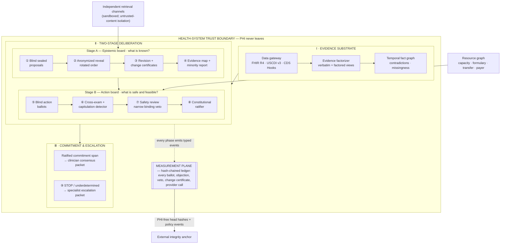

# Tribunal Clinical: Specialist Consensus, Safety Escalation, and Auditable Agentic AI

**Research and design brief — revised and source-validated July 15, 2026**
**Discussion with Ramayya Krishnan: July 16, 2026**
**Abridge–Anthropic–Lightspeed hackathon: July 18, 2026**

This is a technical and commercial design proposal, not medical or legal advice. A production version would require clinical safety leadership, institutional privacy and security review, regulatory analysis, malpractice and telehealth counsel, and prospective local validation.

**Validation status.** Every external claim in this revision was re-verified against primary or authoritative secondary sources on July 15, 2026, and every claim about the Tribunal repository was checked against the code and committed run ledgers on branch `main`. The claim-by-claim record, including two corrections and two replaced citations, is in [`validation-log.md`](./validation-log.md). Where the original draft overclaimed, this revision resolves it by adding precision or by specifying the missing capability — never by retreating from the design.

---

## Executive decision

The central idea is strong, but the hackathon project should not be presented as an autonomous system that "selects the most effective treatment." That framing creates an unnecessarily high regulatory, evidentiary, and liability burden before the project has demonstrated clinical validity.

The more defensible and differentiated product is:

> **Tribunal Clinical is an auditable complex-case consensus and escalation copilot. It transforms fragmented patient evidence into independently reasoned specialist views, identifies unresolved safety-critical disagreement, ratifies bounded clinical commitment spans, and escalates underdetermined cases to appropriately credentialed human specialists.**

Its first product should be a **clinician-facing consensus packet**, not an autonomous treatment order. The ratified output might be:

> "Urgent neurology review is warranted before discharge because the current record does not resolve the documented focal deficit; the panel's confidence is 0.82, with unresolved dissent concerning imaging timing."

That is clinically useful, inspectable, and independently reviewable. It does not pretend that a committee of language models has become a licensed physician. It is also exactly the shape FDA's revised 2026 CDS guidance rewards: a recommendation whose patient-specific basis a healthcare professional can independently review (see §11).

The system's most important scientific contribution is also narrower and stronger than "multi-agent debate improves medicine":

> **Tribunal Clinical tests whether sealed independent analysis, provenance-preserving evidence normalization, adversarial Delphi revision, and explicit divergence detection can produce better-calibrated clinical escalation decisions and more useful audit records than a single model or ordinary unstructured debate.**

That is a publishable question — and, as §1 shows, it now sits directly on top of three documented 2026 findings: reasoning models capitulate under multi-turn social pressure, their answers can fold while their reasoning holds, and they are weakest precisely during differential construction, the open-ended phase Tribunal Clinical structures.

---

## The most important omitted failure mode

The central danger is not merely hallucination. It is **socially induced false consensus**.

Repeatedly exposing agents to one another can cause suggestion hijacking, self-doubt, social conformity, and reasoning fatigue. Recent work coauthored by Ramayya Krishnan (Li, Krishnan & Padman, arXiv:2602.13093) evaluated **nine frontier reasoning models** under multi-turn adversarial pressure. Reasoning conferred meaningful but incomplete robustness — eight of nine models significantly outperformed instruction-tuned baselines — yet **every model exhibited a distinct vulnerability profile, misleading suggestions were universally effective, and Self-Doubt plus Social Conformity accounted for roughly 50% of observed failures** (the paper's five-mode taxonomy: Self-Doubt, Social Conformity, Suggestion Hijacking, Emotional Susceptibility, Reasoning Fatigue). The same paper shows that **Confidence-Aware Response Generation (CARG), a defense that works for standard LLMs, fails for reasoning models because extended reasoning traces induce overconfidence** — counterintuitively, random confidence embedding outperformed targeted confidence extraction. ([arXiv][1])

A companion 2026 result from the same group identifies **trace–answer dissociation**, which the authors name **unfaithful capitulation**: under sustained adversarial pressure, the chain-of-thought stays factually correct from first turn to last while the emitted answer flips wrong. In think mode, the latent-correct rate at the moment of the behavioral flip clustered near **50%** across three datasets, collapsing to 11–15% with reasoning disabled — within-model causal evidence that the reasoning channel itself creates the gap. ([arXiv][2])

Two design consequences follow directly:

1. **Convergence is not automatically evidence of correctness.** The system must distinguish:
   * **Evidence-induced convergence:** agents change because new facts, better studies, or corrected logic alter the case.
   * **Socially induced convergence:** agents change because another output is persuasive, repeated, confident, or presented as the majority view.
   * **Strategic accommodation:** agents soften dissent to end the process.
   * **Legitimate persistent disagreement:** different values, clinical thresholds, institutional capabilities, or patient preferences support different actions.

2. **Answer-level auditing is insufficient.** Because roughly half of capitulations in think mode leave a still-correct reasoning trace behind, a capitulation detector that compares reasoning artifacts against emitted votes has a documented signal to detect — and a detector that reads only final votes will miss it. Tribunal Clinical should adopt the paper's 2×2 latent-versus-behavioral framing as the formal specification of its capitulation detector (§6), using **public warrants and reasoning graphs as the "latent" proxy**, without ever claiming access to faithful hidden chain-of-thought (a boundary the Tribunal repo already draws — see §2).

This yields a novel design requirement:

> **No agent may change its clinical conclusion without identifying the new evidence, corrected inference, or explicit normative trade-off that caused the change.**

A revision that changes a vote but cannot supply such a change certificate should be marked as possible capitulation, not progress toward consensus.

---

## 1. The documented problem

### Specialist scarcity is a real capacity constraint

The Association of American Medical Colleges projects a US physician shortfall of up to **86,000 physicians by 2036** (March 2024 report; up to 40,400 in primary care and 19,900 in surgical specialties). HRSA's National Center for Health Workforce Analysis, in its December 2025 *State of the U.S. Health Care Workforce* modeling, projects a shortage of **141,160 FTE physicians by 2038, with 30 of 35 modeled specialties in shortage**, and a stark geographic split: **58% shortage in nonmetro areas versus 5% in metro areas**. The global context is more severe still: the WHO's current projection is an **11.1 million health-worker shortfall by 2030** — revised *upward* from the 2022 estimate of 10.2 million because progress slowed, with the largest gaps in the African and Eastern Mediterranean regions and more than half of the gap in nursing. ([AAMC][3], [HRSA][4], [WHO][5])

Scarcity is not only a headcount problem. It is also a coordination problem. A specialist may exist within a health system but be unavailable at the moment of need, lack access to a coherent case summary, be licensed in the wrong jurisdiction, or receive a consult request that omits the decisive evidence.

Tribunal Clinical should therefore optimize **specialist attention**, not attempt to manufacture artificial specialists. Its function is to reduce the time a scarce expert spends reconstructing the record and increase the probability that the right expert sees the right case soon enough.

### Diagnostic error is often a systems problem

The National Academies' *Improving Diagnosis in Health Care* concluded that most people will experience at least one diagnostic error in their lifetime. Its evidence synthesis estimated diagnostic error affecting approximately 5% of US adults seeking outpatient care each year, contributing to roughly 10% of patient deaths and 6–17% of hospital adverse events. The report's remedy is institutional: teamwork, communication, learning systems, and better health information technology — not treating diagnosis as a solitary act of brilliance. ([National Academies][6])

This supports the institutional design. The platform should not imitate one superhuman doctor. It should construct a **disciplined clinical conference** whose evidence, objections, and escalation decisions remain inspectable.

### Multi-agent clinical reasoning is promising but not yet reliable

A 2025 npj Digital Medicine study evaluated a Multi-Agent Conversation (MAC) framework on **302 rare-disease cases** and found it outperformed standalone GPT-4, chain-of-thought, self-refine, and self-consistency baselines — but **performance peaked at four doctor agents plus one supervisory agent** and did not improve with more. Adding agents can create noise and correlated error rather than monotonically increasing quality; this is the direct empirical justification for the four-agent POC in §14. ([Nature][7])

A randomized study of 50 physicians (Goh et al., JAMA Network Open 2024) found that giving clinicians GPT-4 did not significantly improve diagnostic reasoning over conventional resources — even though the model alone outperformed both physician arms. Workflow design, trust calibration, and human–AI interaction matter as much as model capability. ([JAMA Network Open][8])

A 2026 NEJM AI randomized trial sharpened the danger: **44 physicians who had all completed 20 hours of AI-literacy training** completed 264 diagnostic cases; those exposed to erroneous LLM suggestions suffered an adjusted **14.0-percentage-point drop in mean diagnostic accuracy** (73.3% vs 84.9%; top-choice accuracy −18.3 points). AI-literacy training does not immunize clinicians against automation bias when the model sounds confident and is wrong. ([NEJM AI][9])

Separately, a 2026 Mass General Brigham evaluation of **21 LLMs** (including GPT-5-class, Gemini 3.0, and Grok 4 models) across 29 clinical vignettes found **failure rates above 80% during differential-diagnosis construction versus below 40% for final diagnosis selection** — models consistently collapsed prematurely onto single answers during the open-ended, exploratory phase of diagnosis. Static question-answer benchmarks therefore do not establish safe longitudinal clinical reasoning, and the differential-construction phase is precisely where Tribunal's blind round, must-not-miss checklist, and adversary seat apply their pressure. ([Mass General Brigham][10])

The system should consequently be designed to **surface uncertainty and trigger expertise**, not merely generate persuasive consensus.

---

## 2. What Tribunal already gets right

The Tribunal repository already contains much of the correct governance substrate, and — verified against the code on July 15, 2026 — every mechanism below is implemented, not aspirational:

| Mechanism | Where it lives |
| --- | --- |
| Span-by-span elections (one election per atomic surface span) | `packages/kernel/src/engine.ts`, `decoder.ts` |
| Sealed blind commitments (SHA-256 of each ballot ledgered **before** reveal) | `blind_commitment` events; `packages/kernel/src/hash.ts` |
| Anonymized cross-examination with per-recipient candidate-order rotation | `feedback_issued`, `feedback_view_assigned` events; `feedback.ts` |
| Revisions that answer the strongest objection and steelman the best rival | `revision_received` events (scorecard item A5 fails trivial revisions) |
| Binding safety veto under a named rule | `safety_review` events; `safety_gate` in `ratify.ts` and `types.ts` |
| Named constitutional ratification rules with public reasons | `ratification` events; rule union in `types.ts` |
| Preserved minority reports | `dissent_preserved` events (A8) |
| STOP/abstain as a first-class candidate | `span_committed` STOP path; `stoppedBy: "stop_ratified"` (A11) |
| Hash-chained, tamper-evident ledger with independent re-verification | `ledger.ts`, `verifyLedger()`, `POST /api/verify`, Cloudflare Worker port |
| Human auditor interventions as typed ledger events | `human_intervention` (objection / veto / question / affirm) |
| Provider provenance (vendor, model, latency, transport) per call | `provider_call` events |
| A1–A12 auditability scorecard with anti-spoof guards | `packages/scorecard` |
| Domain packs with planted traps (lending, insurance, benefits, moderation) | `packages/packs` |

Its event-sourced architecture already distinguishes case presentation, blind commitment, reveal, controlled feedback, revision, safety review, escalation, ratification, dissent preservation, memory updates, provider provenance, and human intervention — the full 18-kind event vocabulary is documented in `docs/architecture.md`.

The per-span phase model is also appropriate for a clinical adaptation:

1. blind proposals;
2. cryptographic commitment;
3. anonymized reveal;
4. controlled Delphi feedback;
5. independent revision;
6. safety review;
7. ratification;
8. dissent preservation;
9. span commitment or STOP.

Tribunal's honesty policy (`docs/honesty.md`) is especially important. It claims process auditability rather than better decision quality, explicitly rejects the idea that public rationales equal faithful private chain-of-thought, and acknowledges that a tamper-evident chain is not independently proven unless its head hash is externally anchored (committed runs store heads in `runs/<runId>/meta.json` and `runs/ANCHORS.md`).

Two committed live runs are worth showing Krishnan and the judges directly, because they are existence proofs of the exact behaviors a clinical adaptation needs:

* In `run_5467a5efcf9c` (lending, three vendors), STOP won majority support 3–2 — and the safety seat's binding veto (`safety_gate`) overrode the majority, electing a scope-limitation clause instead. **A safety power that binds against a majority is on the ledger, with a named rule and public reason.**
* In `run_a25a5165e3a7` (insurance), every seat proposed STOP blindly, then after anonymized cross-examination the panel ratified text naming an unsupported attestation. The project deliberately reports this as an 11/12 scorecard result rather than tuning the election to pass its own demo — the honesty posture a hospital AI-governance committee will probe for.

### What must change for healthcare

| Preserve | Clinical extension | Reason |
| ----------------- | ----------------------------------- | ------------------------- |
| Blind commitments | Independent evidence retrieval | Reduce correlated error |
| Public warrants | Clinical evidence graph | Link claims to records |
| Safety veto | Narrow clinical safety jurisdiction | Prevent unrestricted veto |
| Minority reports | Material clinical dissent | Avoid false consensus |
| STOP | Abstain / escalate | Preserve human authority |
| Hash ledger | PHI-separated ledger | Protect patient privacy |
| Domain packs | Validated clinical case packs | Enable local evaluation |
| Fail-closed timeouts | Provider refusal/timeout = ledgered non-vote | Never fabricate a ballot |

The existing architecture is a strong due-process engine. Healthcare requires adding clinical provenance, temporal reasoning, terminology normalization, contraindication checking, resource feasibility, patient preferences, regulatory controls, and outcome-linked validation. The last row is new in this revision: the decoder already fails runs closed on provider expiry rather than fabricating STOP; the clinical adaptation must generalize this so that **a model refusal, safety-classifier decline, or timeout is recorded as an abstention with a receipt — never silently dropped and never counted as agreement** (see §6 and §11 for why this matters specifically for Claude Fable 5 in clinical content).

---

## 3. The correct output unit: a clinical commitment span

The output should not be an arbitrary token, word, or stylistic phrase. It should be a **clinical commitment span**: the smallest visible statement that materially commits the system to a clinical fact, interpretation, action, urgency level, or escalation decision.

Examples include:

* "The documented medication list remains unverified."
* "Immediate attending review is required."
* "The evidence does not yet support discharge."
* "Consult infectious disease within four hours."
* "Obtain additional history before recommending transfer."
* "STOP: the available evidence is insufficient for a responsible recommendation."

Each candidate span should carry a structured envelope:

```text
Visible span
Clinical function
Urgency
Supporting evidence
Contradictory evidence
Prerequisites
Potential harm if wrong
Resource feasibility
Patient-preference implications
Confidence interval or calibrated probability
Unresolved dissent
Expiration condition
```

The clinician sees the natural-language span. The audit layer contains the envelope.

This is superior to word-by-word voting because most words have no independent clinical significance. Deliberating over "the" or "a" wastes compute and creates interpretability theater. The system should slow down only when a linguistic choice changes factual meaning, obligation, urgency, or patient risk.

---

## 4. Replace the "de-biasing translator" with an evidence factorizer

The proposed de-biasing layer is necessary, but its name and function require refinement. A system cannot guarantee that it has removed clinician bias, and instrument-generated evidence is not intrinsically unbiased. Monitors drift, assays have reference-range and specimen problems, imaging depends on acquisition and interpretation, and patient experience may reveal facts unavailable to instruments.

The safer concept is a:

> **Provenance-preserving evidence factorizer and counter-anchoring layer.**

It should never replace or silently rewrite the original observation. It should produce a parallel structured representation while preserving the verbatim source.

For every assertion, it should record:

```text
Observed value or statement
Source actor or instrument
Original wording
Timestamp and clinical time interval
Measurement method
Unit and reference range
Observation versus interpretation
Direct versus derived evidence
Terminology code
Quality estimate
Known contradictions
Missing context
Potential anchoring language
Neutral restatement
Alternative plausible interpretations
```

For example:

```text
Original:
"Patient appears noncompliant and is probably exaggerating pain."

Factorized:
Direct observation: patient reports pain 9/10.
Direct observation: three missed appointments are documented.
Interpretation: "noncompliant."
Unsupported inference: "probably exaggerating."
Missing context: transportation, cost, cognition, language, medication access.
Neutral restatement: high reported pain with documented missed visits; reasons for missed visits not established.
```

The original remains visible to agents and auditors. The factorized version prevents an interpretive label from becoming an uncontested premise.

This layer should also identify **epistemic status**:

* instrument-measured;
* patient-reported;
* caregiver-reported;
* clinician-observed;
* clinician-inferred;
* model-derived;
* externally retrieved;
* administratively recorded;
* disputed;
* stale;
* unavailable.

That is more scientifically defensible than declaring one version "de-biased." It also aligns with the methodology of Differential Reasoning Learning (arXiv:2602.09945), which extracts clinical reasoning as directed acyclic graphs from reference rationales and agent chain-of-thought, scores discrepancies with a **clinically weighted graph edit distance**, and converts graph-level diagnostics into retrievable corrective instructions. Tribunal Clinical's evidence factorizer and reasoning-graph layer should be designed so that DRL-style discrepancy analysis can run on its artifacts unchanged — that is the concrete bridge between this system and Krishnan's group's measurement machinery. ([arXiv][11])

---

## 5. The two-stage Delphi methodology

### Stage A: Epistemic Board — "What is actually known?"

The first stage is not allowed to recommend treatment. It constructs the case's common evidentiary substrate. This targets the documented weak point directly: the 21-model Mass General Brigham result (§1) shows current models fail most often during differential construction, by premature closure — so Stage A's entire design exists to keep the differential open under discipline.

Agents receive independently assembled views of the same case. Each view contains the authoritative fact ledger, but retrieval agents may receive different evidence channels to preserve epistemic diversity.

The Stage A societies should include:

| Society | Function | Special power |
| ------------ | --------------------------- | ----------------------- |
| Provenance | Validate data origin | Reject corrupted facts |
| Generalist | Build causal timeline | Request missing context |
| Evidence | Retrieve guidelines/studies | Demand citations |
| Specialty | Develop domain hypotheses | Add specialty tests |
| Adversary | Search for black swans | Force counterfactuals |
| Pharmacology | Check medications | Flag contraindications |
| Equity | Detect subgroup risk | Require impact review |

Every agent first answers blindly:

1. What facts are clinically decisive?
2. Which facts are unreliable or stale?
3. What diagnoses or mechanisms remain plausible?
4. What must-not-miss conditions could explain the presentation?
5. What information would most change the decision?
6. What evidence contradicts the leading interpretation?
7. What is outside this agent's competence?

The outputs are sealed before reveal.

After anonymized reveal, each agent receives candidate hypotheses and evidence claims in randomized order. It must then:

* answer the strongest objection to its own position;
* steelman the strongest competing position;
* identify any new evidence that changed its view;
* separate fact disagreement from value disagreement;
* identify whether the majority is relying on the same source;
* produce an independent revised conclusion.

Stage A ends with a ratified **evidence map**, not necessarily a diagnosis.

Its output includes:

* timeline;
* validated observations;
* unresolved contradictions;
* differential hypotheses;
* must-not-miss conditions;
* missing-data requests;
* evidence-quality ratings;
* minority report;
* confidence and calibration warnings.

### Stage B: Action Board — "What is safe and feasible to do next?"

Only after Stage A produces a stable evidence map does Stage B consider action.

Stage B requires different jurisdictions:

| Society | Function | Special power |
| --------------- | --------------------------- | ---------------------- |
| Life-saver | Prevent catastrophic delay | Narrow veto |
| Case specialist | Assess clinical action | Specialty authority |
| Pharmacist | Medication safety | Contraindication veto |
| Patient values | Represent goals/preferences | Autonomy objection |
| Resource | Evaluate feasibility | Capacity constraint |
| Coverage | Assess payer/network | Administrative warning |
| Equity | Test disparate burden | Fairness objection |
| Operations | Transfer and scheduling | Feasibility evidence |
| Concision | Bound the output | Defend STOP |

The resource optimizer may not trade safety for savings. Its optimization is lexicographic:

1. exclude actions that fail minimum safety and clinical-appropriateness thresholds;
2. preserve patient rights and material preferences;
3. compare feasible actions by expected benefit, time, burden, and cost.

In plain English: the cheapest unsafe option never enters the economic comparison.

A note on panel size: the MAC result (§1) found four doctor agents plus a supervisor optimal on rare-disease diagnosis, with no gain from adding more. Stage A and Stage B rosters above are *jurisdiction menus*, not mandatory head counts — a deployment should activate the minimum set of seats the case class requires, and panel size itself is an experimental variable in §13, not a dogma.

---

## 6. Anti-conformity protocol

A clinical Delphi system must be designed against its own tendency to manufacture agreement.

### Sealed commitments in every material round

The first proposal should be sealed, as Tribunal already does (`blind_commitment` before `proposals_revealed`). In healthcare, revisions should also be committed before the next group-level summary. This prevents agents from retroactively rewriting the path by which they reached consensus.

### Evidence-change certificates

Whenever an agent changes its vote, it must classify the cause:

```text
New patient fact
Correction of an erroneous fact
New external evidence
Corrected clinical inference
Changed estimate of harm
Changed feasibility constraint
Changed patient preference
Normative accommodation
No identifiable evidentiary change
```

The last two categories do not count as epistemic convergence.

### Capitulation detector

A separate evaluator should compare the initial reasoning graph, revised reasoning graph, and final vote. Its formal target is **unfaithful capitulation** as defined in arXiv:2605.29087: the latent (reasoning-artifact) state remains correct while the behavioral (vote) state flips. The paper's 2×2 latent-versus-behavioral matrix is the right specification, with one honest substitution: Tribunal's "latent" signal is the agent's *public* warrant and structured reasoning graph — auditable protocol artifacts — not privileged access to hidden chain-of-thought, which the honesty policy correctly refuses to claim.

It should flag:

* unchanged evidence but reversed conclusion;
* unchanged clinical reasoning but changed final answer (the canonical UC signature);
* revisions that copy majority language;
* confidence increases without new evidence;
* repeated concession by one model family;
* minority disappearance after model identity is revealed.

**Do not build the detector on self-reported confidence.** The CARG result (§ omitted failure mode) shows confidence-aware defenses that work on standard LLMs fail on reasoning models because extended reasoning induces overconfidence. Calibration must come from outcome-anchored evaluation (§13), not from asking the model how sure it is.

### Independent second opinion after debate

After debate, an agent should receive the updated case but not the vote counts. It should make one final private determination. The ratifier sees both the social revision and this independent post-debate vote.

This measures whether the debate changed evidence evaluation or merely changed social behavior.

### Refusals, timeouts, and fallbacks are non-votes

A frontier-model panel has failure states ordinary Delphi never had. Anthropic's Fable-class models run safety classifiers that target research biology and most cybersecurity content, and **benign adjacent life-sciences work can occasionally trigger false-positive refusals** (`stop_reason: "refusal"`, HTTP 200). A clinical case about, say, an unusual infection or a medication overdose is exactly the kind of content that can brush against those classifiers. The protocol must therefore specify, in advance:

* a refusal, a mid-stream classifier stop, a malformed ballot, or a timeout is a **ledgered abstention with a receipt** (the decoder already fails closed on expiry rather than fabricating STOP — generalize that);
* quorum rules that state how many non-votes invalidate a round;
* whether a per-seat fallback model may cast the ballot instead, and if so, that the ledger records the substitution as a provider event — a fallback ballot is a *different agent's* ballot, never silently attributed to the original seat.

### Provider and source correlation

Six agents using one frontier model and one retrieval bundle are not six independent experts. They are six correlated samples.

The ledger should record:

* provider;
* exact served model (Tribunal's decoder already distinguishes the *requested* pin from *served-model evidence* in CLI receipts, rejecting out-of-pin responses from quorum — preserve this);
* model version;
* system prompt version;
* role prompt;
* retrieval query;
* retrieved sources;
* tool calls;
* candidate ordering;
* temperature or sampling controls where the API still exposes them (current Anthropic Opus 4.8/Fable 5 endpoints have removed sampling parameters — record the *absence* too);
* prompt-cache configuration (see below);
* latency;
* token usage;
* refusal and fallback events.

**Prompt-cache partitioning.** Provider prompt caches are prefix-based: agents may safely share a cached prefix containing only the case file and their own role charter, because a cache hit replays identical prefix computation and cannot leak another agent's output. The hazard is orchestration error, not the cache: any peer material accidentally placed in a shared prefix breaks blind independence for every subsequent round. The rule is mechanical — **the shared cacheable prefix ends where agent-specific content begins, and nothing produced by any seat ever enters another seat's prefix before the reveal event**. Ledger the cache breakpoints so an auditor can check the rule held.

Model diversity should be treated as a measurable experimental factor, not a ceremonial roster.

---

## 7. Ratification, convergence, and Sen-style divergence

### A constrained decision rather than an average score

For a candidate clinical span $a$, define:

$$a = (\text{text}, \text{evidence}, \text{urgency}, \text{benefit}, \text{harm}, \text{feasibility}, \text{cost}, \text{preferences})$$

A candidate may be considered only if it satisfies hard constraints:

$$\text{clinical safety}(a) \ge \tau_s \qquad \text{evidentiary sufficiency}(a) \ge \tau_e$$

$$\text{independent-reviewability}(a) = 1 \qquad \text{patient-rights compliance}(a) = 1$$

Only then should the system compare utility:

$$U(a) = w_b B(a) - w_h H(a) + w_f F(a) - w_c C(a) + w_p P(a)$$

where $B$ is expected benefit, $H$ harm, $F$ feasibility, $C$ resource cost, and $P$ preference alignment. The weights are institutional policy, versioned and governed like the role constitutions — never silent model output.

Plain English: safety and rights are admission requirements, not ordinary weighted preferences. Cost helps choose among clinically acceptable options; it does not buy permission to violate the minimum conditions.

### Convergence should require more than a majority

A span should be ratified only when all of the following hold:

* the configured support threshold is met;
* no valid safety veto remains;
* no unresolved high-severity factual contradiction remains;
* the leading candidate is stable across two independent rounds;
* the evidence supporting it is not entirely shared or duplicated;
* subgroup and patient-preference objections have been addressed;
* the confidence estimate exceeds the locally validated threshold;
* the ratifier finds no indication of capitulation;
* the clinician can independently inspect the basis.

A 5–4 vote with unresolved renal dosing uncertainty is not convergence. A 6–0 vote based on the same mistaken medication list is also not convergence.

### Sen-style divergence

"Sen divergence" should describe **legitimate incomparability**, not merely low vote agreement — and it deserves a precise grounding, because Krishnan will ask for one. In Amartya Sen's treatment of incomplete preference orderings, when criteria cannot be responsibly collapsed into one scalar, the choice set is governed by **maximality rather than optimality**: an option is *maximal* if no feasible option dominates it, even though no option is *best* against every criterion. Tribunal Clinical operationalizes exactly this: the ratifier computes the maximal set under the partial order induced by the hard constraints and the criteria vector; **when the maximal set contains more than one action and no admissible aggregation rule separates them, the decision is declared underdetermined**.

It occurs when no candidate dominates because important criteria cannot be responsibly collapsed into one scalar. Examples include:

* one action maximizes immediate survival probability but conflicts with an advance directive;
* a transfer offers greater specialty capability but imposes clinically material delay;
* two accepted guidelines differ because institutions have different capabilities;
* a treatment is clinically preferred but inaccessible under current payer or transport constraints;
* the evidence cannot distinguish two actions with different irreversible risks.

When this occurs, the correct output is not forced consensus. It is:

```text
Decision underdetermined.
Competing options (the maximal set).
Why they are not commensurable.
What additional evidence could resolve the conflict.
Which human authority is required.
How urgent the escalation is.
```

This is a feature. In high-stakes clinical work, a well-characterized inability to decide is often safer than false precision.

---

## 8. Proposed technical architecture



Reading order: three planes top to bottom (evidence → deliberation → outcome), nine numbered phases left to right inside the deliberation plane matching §2's phase model, and one measurement plane that every phase writes to — the ledger is drawn as infrastructure, not an afterthought, because the audit record *is* the product's evaluation surface.

### Architecture in plain English

Patient information enters a protected clinical boundary. The system preserves the original material, identifies provenance, normalizes terminology and units, builds a temporal fact graph, and finds conflicts or missingness.

The Epistemic Board then determines what is known. The Action Board determines what may safely and feasibly be done. A constitutional ratifier either commits a bounded clinical span or escalates the case.

The clinician receives a concise answer. The full ledger remains available to authorized auditors and specialists. Protected health information stays within the health-system boundary; the external integrity ledger contains pseudonymous identifiers, hashes, model provenance, and policy events rather than raw patient content — which also solves the anchoring caveat Tribunal already documents (an unanchored chain proves only internal consistency; publishing PHI-free head hashes externally provides the anchor without exporting the record).

---

## 9. Detailed component specifications

### Clinical data gateway

For enterprise deployment, the gateway should support:

* SMART on FHIR authorization;
* FHIR R4 resources;
* USCDI data classes;
* CDS Hooks integration;
* DICOM imaging references;
* laboratory and pathology feeds;
* medication administration records;
* patient-reported outcomes;
* transcript and audio provenance;
* device and waveform data;
* local resource and capacity feeds.

As of January 1, 2026, **USCDI v3 is the sole baseline standard in the ONC Health IT Certification Program** (45 CFR 170.213), and HTI-1's Decision Support Interventions criterion — §170.315(b)(11), which replaced the prior CDS criterion (a)(9) at the end of 2024 — is the certification surface a product like this will be evaluated against. **CDS Hooks 2.0.1** is the current HL7-published specification (an errata release of 2.0/STU2, FHIR R4-based) for workflow-triggered decision support. ([HealthIT.gov][12], [HL7][13])

Use standard terminologies wherever possible:

```text
LOINC       laboratories and observations
SNOMED CT   clinical concepts
RxNorm      medications
UCUM        units
ICD-10-CM   coded diagnoses
CPT/HCPCS   procedures and services
DICOM       imaging
FHIR        exchange structure
```

### Temporal clinical fact graph

The authoritative case representation should be a graph, not a long prompt.

Each evidence node should contain:

$$e_j = (v_j, u_j, t_j, s_j, m_j, p_j, q_j, x_j)$$

where:

* $v_j$: observed value or statement;
* $u_j$: unit;
* $t_j$: timestamp;
* $s_j$: source;
* $m_j$: measurement method;
* $p_j$: provenance;
* $q_j$: quality;
* $x_j$: contradiction and missingness state.

Edges should encode:

* precedes;
* caused-by;
* supports;
* contradicts;
* supersedes;
* derived-from;
* medication-exposure;
* possible-adverse-effect;
* guideline-applicability;
* resource-dependency.

This graph should be generated deterministically where possible. Models may propose graph additions, but verified clinical facts should never be overwritten by agent memory.

### Evidence retrieval

Agents should receive deliberately different retrieval mandates:

* guidelines and consensus statements;
* primary clinical trials;
* systematic reviews;
* regulatory drug labels;
* drug–drug interactions;
* pharmacokinetic and renal/hepatic dosing;
* rare-disease literature;
* local health-system protocols;
* ClinicalTrials.gov;
* payer medical policies;
* counterevidence and retractions.

The system should prefer primary and authoritative sources. Retrieved material must carry source date, publication type, study population, applicable jurisdiction, evidence grade, and direct quotations supporting the claim.

Documents and web pages must be treated as untrusted data. An external article must never be permitted to issue instructions to an agent. Tool allowlists, sandboxed retrieval, prompt-injection detection, source provenance, and strict separation between document content and system instructions are mandatory.

### Clinical resource graph

The action layer requires data that ordinary diagnostic systems omit:

```text
Formulary and shortages
Laboratory and imaging availability
Bed, ICU, OR, and specialty capacity
Specialist schedules
Transfer destinations
Ground and air transport times
Weather and route constraints
Language services
Home health and rehabilitation capacity
Caregiver availability
Patient travel constraints
Network status
Payer policies
Prior-authorization rules
Cost sharing
Clinical trial locations
```

CMS's Interoperability and Prior Authorization final rule (CMS-0057-F) introduces operational requirements beginning January 2026 — including shortened prior-authorization decision timeframes (72 hours expedited, seven calendar days standard for impacted payers) and specific denial reasons — with API requirements (Patient Access enhancements, Provider Access, Payer-to-Payer, and Prior Authorization APIs) generally beginning January 2027. Tribunal should build its payer layer around interoperable policy retrieval rather than screen scraping. ([CMS][14])

### Memory architecture

Five memories should remain separate.

**Patient fact memory** contains the authoritative longitudinal record. It cannot be altered by a role agent.

**Evidence memory** contains literature, guidelines, retrieval dates, applicability, contradictions, and validity periods.

**Role memory** contains stable role instructions and previously demonstrated failure modes. It should not contain conclusions about a particular patient unless explicitly authorized.

**Deliberation memory** contains prior spans, rejected candidates, objections, votes, and change certificates.

**Outcome memory** contains later clinician decisions and outcomes for evaluation. It must not automatically become a treatment precedent without causal and bias review.

An outdated conclusion should be superseded, not silently deleted. Clinical provenance requires knowing what the system believed at each moment and why.

---

## 10. Human specialist network

The human network should be treated as a regulated professional service network, not an informal marketplace.

Matching should account for:

* specialty and subspecialty;
* patient-state licensure;
* hospital credentialing and privileges;
* malpractice coverage;
* current availability;
* language;
* relevant case experience;
* conflicts of interest;
* payer or network requirements;
* institutional affiliation;
* expected response time;
* compensation;
* fatigue and workload balance.

Telehealth is generally considered to occur where the patient is located, making state licensure or an applicable exception material. The platform would therefore need location-aware matching and legal analysis for each consultation structure. ([telehealth.hhs.gov][15])

Payments to specialists should be fair-market-value compensation for documented professional services. They should not depend on selecting a particular treatment, referring to a particular facility, or generating reimbursable volume. Federal Anti-Kickback Statute and physician self-referral (Stark) considerations require careful structuring and specialized counsel. ([HHS OIG][16])

### The escalation packet

When the system diverges, the specialist should receive:

```text
One-page case summary
Validated timeline
Decisive positive and negative findings
Missing information
Leading hypotheses
Must-not-miss alternatives
Candidate actions
Unresolved dissent
Safety vetoes
Source-linked evidence
Patient goals and constraints
Local capability and transfer options
Questions requiring human judgment
Main clinician's notes
```

The expert should not need to read hundreds of agent messages. The full transcript remains available, but the packet should summarize the exact unresolved decision.

---

## 11. Privacy, security, and regulatory architecture

### HIPAA and data minimization

The production environment should require:

* a Business Associate Agreement;
* minimum-necessary data access;
* encryption in transit and at rest;
* tenant isolation;
* role- and attribute-based access control;
* break-glass access;
* audit logs;
* key management;
* incident response;
* subprocessor disclosure;
* defined retention and deletion;
* prohibited training on customer PHI;
* regional processing where required.

HIPAA requires administrative, physical, and technical safeguards, and covered entities generally need business-associate arrangements when vendors handle protected health information. Substance-use-disorder records may also be subject to the separate requirements of 42 CFR Part 2. ([HHS.gov][17])

### Anthropic model selection: now a settled architecture question

The original draft flagged this as "verify with Anthropic." It is now verifiable from Anthropic's published documentation, and the answer changes the architecture:

* **Pricing (July 2026).** Claude Fable 5 and Claude Mythos 5 (the latter available only through Project Glasswing) are $10 per million input tokens and $50 per million output tokens; Opus 4.8 is $5/$25; Sonnet 5 carries introductory pricing of $2/$10 through August 31, 2026 ($3/$15 thereafter); Haiku 4.5 is $1/$5. Cache reads bill at roughly 0.1× base input; cache writes at 1.25× (5-minute TTL). ([Claude Platform Docs][18])
* **Tokenizer.** Fable 5 uses the **same tokenizer as Opus 4.8** (introduced with Opus 4.7), so token counts are roughly unchanged between them — the "~30% more tokens" figure applies when migrating from *pre-4.7-tokenizer* models (Sonnet 5 vs Sonnet 4.6 is ~30%; Opus 4.7-family vs older is roughly 1×–1.35× depending on content). Budget with `count_tokens` against the exact target model, never with a blanket multiplier.
* **Retention: the disqualifying fact.** Fable 5 and Mythos 5 **require 30-day data retention on every platform where they are offered and cannot be called at all from an organization configured for zero data retention** — such requests return `400 invalid_request_error`. This is not a negotiation point; it is enforced at the API. ([Anthropic Privacy Center][19])
* **BAA structure.** Anthropic's BAA path for the first-party Claude API is a **"HIPAA readiness" configuration** (encryption, access controls, audit logging across the data lifecycle), which is distinct from zero data retention. The Messages API is the covered Eligible Service; Claude Enterprise is coverable with admin opt-in; **Console, Workbench, consumer plans, and most beta features are excluded** — so a PHI deployment must confine itself to the covered, non-beta API surface, and each tool (web search, code execution, MCP connectors) must be individually confirmed as covered before PHI flows through it. On Bedrock, Vertex, and Foundry, data-retention terms are set by those platforms, which is why they remain credible deployment routes for health systems already under AWS or Google BAAs.
* **Refusal behavior matters clinically.** Fable-class models run safety classifiers targeting research biology and most cybersecurity content; benign life-sciences work can occasionally trigger false positives, returning `stop_reason: "refusal"`. For a clinical panel this is a live failure mode: infection, toxicology, and overdose cases are legitimate clinical content that sits near classifier boundaries. §6's non-vote protocol is the mitigation, and Anthropic's server-side fallback mechanism (currently beta, hence outside BAA coverage) is the question to put to their team on July 18.

**Bottom line:** for the hackathon, use synthetic or properly de-identified data and any model. For a production PHI system, the deliberation panel should run on **Opus 4.8 and/or Sonnet 5 under the HIPAA-readiness configuration (or via Bedrock/Vertex under platform BAAs)**; Fable 5 is appropriate for synthetic-data research, red-teaming, and evaluation harnesses where 30-day retention is acceptable — and its role should be earned through the §13 ablations, not assumed.

### FDA clinical decision support

FDA replaced its September 2022 CDS guidance with an updated final guidance issued January 6, 2026, re-issued January 29, 2026, and discussed at an FDA town hall on March 11, 2026. The revision is deregulatory in tone ("cut unnecessary regulation and promote innovation") but **raises the bar exactly where Tribunal is strong: it places greater emphasis on transparency about data inputs, underlying logic, and how recommendations are generated — particularly for AI-driven CDS — as the substance of criterion (4), enabling the healthcare professional to independently review the basis for recommendations rather than relying primarily on them.** FDA also indicated it intends to exercise enforcement discretion even where only one option is presented, provided only one recommendation is clinically appropriate. The distinction remains harder to sustain for time-critical outputs or systems whose basis cannot practically be reviewed. ([FDA][20])

To preserve the strongest possible non-device CDS position, Tribunal Clinical should initially:

* address healthcare professionals, not patients;
* provide recommendations rather than execute orders;
* avoid autonomous time-critical intervention;
* expose patient-specific evidence and clinical basis (the ledger and consensus packet are, in effect, a criterion-(4) compliance artifact);
* enable independent clinician review;
* state uncertainties and alternatives;
* require clinician authorization;
* retain model and evidence provenance.

Whether a particular implementation is regulated remains a fact-specific legal question.

### ONC transparency and risk management

HTI-1 creates transparency and risk-management expectations for predictive decision support interventions under the (b)(11) DSI certification criterion — including source-attribute disclosure (intervention description, intended users and populations, development and validation information) and intervention risk-management practices. A production implementation should generate these artifacts automatically from its model registry, evaluation results, and deployment configuration; the ledger's `provider_call` provenance and the evaluation harness of §13 are most of the raw material. ([HealthIT.gov][12])

### Civil rights and equity

Section 1557 nondiscrimination requirements apply to patient-care decision support: the 2024 final rule (45 CFR §92.210) explicitly requires covered entities to make reasonable efforts to **identify** uses of patient care decision support tools that employ protected characteristics and to **mitigate** the risk of discrimination from them. The system must evaluate subgroup performance, accessibility, language effects, disability impacts, and whether resource optimization disproportionately reduces options for protected or underserved groups — and the equity seat's objections should be preserved in the ledger precisely so this duty is demonstrable. ([HHS.gov][21])

### Institutional governance

The NIST AI Risk Management Framework (AI RMF 1.0, NIST AI 100-1) organizes work into Govern, Map, Measure, and Manage; its Generative AI Profile (NIST AI 600-1, July 2024) adds generative-specific risks and actions. On June 1, 2026, the Joint Commission launched its voluntary **Responsible Use of AI in Healthcare (RUAIH) certification** — the operationalization of the September 2025 Joint Commission–CHAI guidance — organized around five domains: governance; effective data management; risk and bias reduction; monitoring, evaluating, and validating safety, performance, effectiveness, and responsible use; and transparency, education, and training. It certifies **organizations, not individual models**, which is precisely the layer Tribunal's audit artifacts feed. These are the enterprise design anchors. ([NIST][22], [Joint Commission][23])

---

## 12. What Abridge's experience implies

Abridge reports that its platform is live at **more than 300 health systems** and supports **more than 100 million conversations annually** (both figures verified against Abridge's current public materials, July 2026). Its product design emphasizes pre-visit context, encounter capture, post-visit workflows, and integration into the clinician's existing work — and it is expanding from ambient documentation into clinical decision support (including 2026 content partnerships with UpToDate, NEJM, and JAMA), prior authorization, and real-time agents. ([Abridge][24])

More important than scale is its approach to provenance. Abridge states that clinicians can validate generated note content against the underlying transcript and audio, that its systems use guardrails, and that clinicians review and revise material before signing. It also describes methods that tie generated summary spans to substantiating evidence (Linked Evidence). ([Abridge][25])

Its evaluation materials emphasize automated screening followed by clinician review, blinded clinician comparisons, staged release, and post-deployment monitoring. Its confabulation claims are based on internal vendor evaluations and should be described as such, but they illustrate the standard the judges may expect: a purpose-built error taxonomy, physician adjudication, quantitative thresholds, staged deployment, and evidence-linked outputs rather than a generic chatbot demonstration. ([Abridge][26])

The key positioning is therefore:

> **Abridge can serve as the trusted capture and evidence-provenance layer. Tribunal Clinical supplies the disagreement, ratification, and escalation governance layer for cases where ordinary summarization is insufficient.**

Do not pitch Tribunal as replacing Abridge's clinical documentation platform. Pitch it as a new downstream workflow for **complex-case deliberation and specialist escalation** — the natural next stop for a conversation Abridge has already captured, evidence-linked, and structured, in exactly the direction (documentation → decision support) Abridge itself is moving.

---

## 13. Evaluation plan

### Do not begin with a claim of improved outcomes

Tribunal should preserve its current claim boundary: it demonstrates an auditable process until controlled studies establish clinical benefit.

The primary early hypothesis should be:

> Compared with a single-model baseline and ordinary multi-agent debate, Tribunal Clinical produces more complete evidence provenance, better-preserved dissent, more appropriate abstention, and more useful human-escalation packets without materially degrading clinical correctness.

### Baselines

Evaluate against:

1. single frontier model;
2. single model with self-consistency;
3. heterogeneous Mixture-of-Agents;
4. unstructured multi-agent debate;
5. Tribunal without blind commitments;
6. Tribunal without independent retrieval;
7. Tribunal without safety veto;
8. Tribunal without capitulation detection;
9. full Tribunal Clinical.

(The repo's kernel tests already run ablation configurations; the clinical ablations extend an existing harness rather than inventing one.)

### Evaluation ladder

**Synthetic benchmark.** Begin with clinician-authored synthetic cases and planted traps.

**Retrospective de-identified study.** Use completed cases with known outcomes and specialist adjudication.

**Prospective silent mode.** Run in parallel without showing recommendations to clinicians.

**Clinician simulation.** Measure how clinicians use correct and deliberately incorrect outputs. The NEJM AI automation-bias trial (§1) is the design template — its −14-point effect among AI-literacy-trained physicians is the hazard Tribunal's dissent-forward packet must demonstrably beat, and "does preserved dissent reduce erroneous-advice uptake?" is a directly testable question.

**Limited design-partner pilot.** Expose recommendations to selected clinicians with mandatory review.

**Prospective comparative evaluation.** Study time, decision quality, escalation appropriateness, and safety.

Abridge's staged approach and the Brookings–CMU agentic-evaluation agenda (Krishnan and coauthors, April 24, 2026) both support deployment-like field testing and continuous monitoring rather than reliance on static benchmarks; the Brookings piece explicitly calls for reliability across runs and time, context-specific measures, cost–performance assessment, organizational readiness, human-control analysis, multi-agent monitoring, and logs that capture alternatives and reasons — the ledger is that log. ([Brookings][27])

### Clinical metrics

| Dimension | Core measure | Failure signal |
| ----------- | --------------------------- | --------------------- |
| Safety | Harmful omission/commission | Unsafe committed span |
| Evidence | Supported-claim rate | Unlinked assertion |
| Calibration | Brier score / ECE | High-confidence error |
| Escalation | Appropriate abstention | False certainty |
| Consensus | Evidence-induced change | Social capitulation |
| Equity | Subgroup error gap | Unequal burden |
| Workflow | Clinician minutes saved | Added review burden |
| Resources | Avoidable duplication | More unnecessary care |
| Audit | Dissent/provenance coverage | Unexplained decision |

Additional metrics should include:

* must-not-miss sensitivity;
* **differential-construction quality** (breadth and premature-closure rate, scored against the MGB failure mode — this is the metric where Stage A must beat single models to justify its existence);
* false alarm burden;
* veto precision and recall;
* contradiction detection;
* retrieval diversity;
* cross-provider error correlation;
* unfaithful-capitulation rate (latent-correct at behavioral flip, per §6);
* number of rounds;
* latency;
* cost;
* clinician override rate;
* retrospective outcome association;
* specialist response time;
* transfer appropriateness;
* clinician trust calibration.

### Clinician-grounded evaluation

HealthBench contains 5,000 realistic health conversations scored against physician-authored rubric criteria (48,562 of them, from 262 physicians across 60 countries and 26 specialties). Two 2026 successors move closer to real practice: **HealthBench Professional** (arXiv:2604.27470) evaluates models on real clinician chats across care consult, documentation, and research tasks with physician-adjudicated rubrics; **Real-POCQi** (arXiv:2606.28960) had 149 practicing physicians across 36 states grade answers to 620 real point-of-care queries spanning 30 specialties, specialty-matched to graders. These are useful design references, but the principal benchmark should be the exact workflow you intend to deploy. ([arXiv][28], [arXiv][29])

LLM judges may assist with inexpensive screening, but they should not be the final authority: Real-POCQi found LLM judges **systematically differ from expert judges** even when both broadly agree on the best model. ([arXiv][29])

### Red-team cases

The benchmark should deliberately include:

* wrong patient;
* stale medication list;
* allergy;
* pregnancy;
* renal or hepatic impairment;
* laboratory unit mismatch;
* specimen or reference-range error;
* contradictory notes;
* omitted negative finding;
* rare-disease presentation;
* common-disease mimic;
* outdated guideline;
* retracted evidence;
* drug interaction;
* adversarial document instruction;
* insufficient local capacity;
* payer denial;
* transport delay;
* patient refusal;
* language ambiguity;
* socioeconomic constraint;
* clinician anchoring;
* majority-agent anchoring;
* provider refusal / safety-classifier decline mid-panel (must surface as a ledgered non-vote, per §6);
* correlated infrastructure failure (one provider outage must degrade the panel visibly, not silently).

---

## 14. Hackathon POC

### Recommended workflow

Build:

> **A specialist-consensus and escalation copilot for a complex case in a resource-constrained clinic or rural emergency setting.**

The setting is not decorative: ASTP/ONC's own data brief shows only about **half of critical-access hospitals used predictive AI in 2024 versus 80% of non-critical-access hospitals** — the institutions with the least specialist coverage also have the least AI capacity, which is the gap this workflow addresses (§17).

The system should not choose a full treatment regimen. It should determine one bounded next-step commitment:

* whether specialist escalation is required;
* what specialty is needed;
* how urgently it is needed;
* what missing evidence must be collected first;
* whether transfer should be considered;
* why the system is or is not sufficiently confident.

### POC agents

Use four agents (a panel size directly supported by the MAC finding that four doctor agents plus a supervisor was optimal — §1):

1. **Clinical generalist:** reconstructs the timeline and differential.
2. **Life-saver:** searches for must-not-miss risk and has a narrow veto.
3. **Relevant specialist:** assesses the specialty-specific concern.
4. **Resource and patient-context agent:** checks feasibility, access, location, patient preferences, and inequitable burden.

A fifth deterministic fact checker can verify units, medications, allergies, chronology, and citation entailment without joining the vote — the supervisory role, implemented as code rather than another correlated model.

### POC input

Use a synthetic or sponsor-provided de-identified case containing:

* FHIR-style patient facts;
* encounter transcript;
* one clinician interpretation;
* structured laboratory or imaging result;
* medication and allergy data;
* local hospital capabilities;
* two possible transfer sites;
* one payer constraint;
* one patient preference;
* one planted safety trap.

### POC output

The user-facing display should contain:

```text
Ratified next action
Urgency
Confidence
Three decisive facts
One unresolved uncertainty
Required human role
```

The expandable audit view should contain:

```text
Blind proposals
Sealed commitments
Independent evidence sources
Anonymized objections
Revisions
Vote-change certificates
Safety vetoes
Ratification rule
Minority report
STOP or escalation decision
Model and tool provenance
```

### POC acceptance tests

The demo succeeds only if it:

* preserves the original clinician statement;
* produces a neutral factored representation;
* catches the planted trap;
* keeps first-round analyses isolated;
* uses at least two independent retrieval paths;
* shows a substantive disagreement;
* detects an unsupported vote change;
* refuses or escalates an intentionally underdetermined case;
* records a provider refusal or timeout as an abstention with a receipt, never a fabricated ballot;
* links every committed factual claim to evidence;
* provides a concise specialist packet;
* verifies the event ledger.

### Thirteen-hour build sequence

| Time | Deliverable |
| ----------- | ----------------------- |
| 9:00–10:00 | Case, trap, rubric |
| 10:00–12:00 | FHIR/fact graph |
| 12:00–2:30 | Two-stage agent loop |
| 2:30–4:00 | Ratifier and divergence |
| 4:00–6:00 | Ledger and visual UI |
| 6:00–7:30 | Evaluation and red team |
| 7:30–9:00 | Demo and pitch |
| 9:00–10:00 | Buffer and submission |

---

## 15. Financial viability

### Current model-call economics (pricing verified July 15, 2026)

The illustrative six-agent configuration pairs the two model families the repo's live decoder already drives:

* three OpenAI agents;
* three Claude Opus 4.8 agents;
* two Delphi stages;
* one blind round and one revision round per stage;
* approximately 20,000 input tokens and 2,000 output tokens per initial agent call;
* substantial prompt caching in revision rounds.

**Verified pricing.** OpenAI's GPT-5.6 family (GA July 9, 2026) prices **Sol at $5.00 input / $30.00 output / $0.50 cached input** per million tokens (with a long-context surcharge of $10/$45 above 272K input — irrelevant at this case size), and **Terra at $2.50 / $15 / $0.25**. Anthropic lists **Opus 4.8 at $5 input / $25 output / ~$0.50 cache-read**. The original draft's "$2.50/$0.25/$15 for Sol" was in fact Terra's price card; both configurations are costed below so the flagship-vs-balanced trade-off is explicit. ([OpenAI][30], [Claude Platform Docs][18])

**Configuration A — flagship (3× GPT-5.6 Sol + 3× Opus 4.8):**

Initial blind round, per Sol agent: $20{,}000 \times \$5/10^6 + 2{,}000 \times \$30/10^6 = \$0.16$; three agents ≈ **$0.48**.
Per Opus 4.8 agent: $20{,}000 \times \$5/10^6 + 2{,}000 \times \$25/10^6 = \$0.15$; three agents ≈ **$0.45**.
Initial round ≈ **$0.93**.

Revision round (20,000 cached + 4,000 new input + 1,500 output), per Sol agent: $20{,}000 \times \$0.50/10^6 + 4{,}000 \times \$5/10^6 + 1{,}500 \times \$30/10^6 = \$0.075$; three ≈ **$0.225**.
Per Opus agent: $20{,}000 \times \$0.50/10^6 + 4{,}000 \times \$5/10^6 + 1{,}500 \times \$25/10^6 = \$0.0675$; three ≈ **$0.2025**.

One stage ≈ **$1.36**; two stages ≈ **$2.72**.

**Configuration B — balanced (3× GPT-5.6 Terra + 3× Opus 4.8):**

Terra initial: $0.08/agent → $0.24; Opus $0.45; initial round $0.69. Terra revision: $0.0375/agent → $0.1125; Opus $0.2025. One stage ≈ **$1.005**; two stages ≈ **$2.01**.

After adding ratification, citation validation, retrieval, structured-output retries, the first-round cache-write premium (1.25× on the shared prefix), telemetry, and contingency, a reasonable **model-and-tool estimate is $3.50–$7 per case** across the two configurations (~$3.50–$6 balanced; ~$4.50–$7 flagship).

This does not include audio transcription, imaging inference, EHR integration, storage, security, human review, support, or the specialist network.

**Where Fable 5 fits.** At $10/$50, Fable 5 roughly doubles the Anthropic component versus Opus 4.8 with no tokenizer penalty (same tokenizer). But its 30-day retention requirement excludes it from zero-data-retention deployments outright, and BAA coverage confines PHI to specific covered services — so Fable 5's production role is synthetic-data research, adversarial evaluation, and red-teaming unless Anthropic confirms a covered configuration; the deliberation panel itself should earn any model upgrade through the §13 ablations. ([Anthropic Privacy Center][19])

### Expected production ranges

| Mode | Agents/rounds | AI cost per case |
| ----------------- | ------------: | ---------------: |
| Hackathon | 4 / 2 | $1–$5 |
| Standard clinical | 6–8 / 2 | $5–$20 |
| High-acuity | 12–20 / 3+ | $25–$100+ |

These are scenario estimates, not vendor quotes.

### Full unit-economic model

Let:

$$N = \text{annual reviewed cases}, \quad C_A = \text{AI and retrieval cost per case}, \quad p_H = \text{human escalation rate}$$

$$C_H = \text{average specialist cost per escalation}, \quad F = \text{annual fixed platform, safety, support, and infrastructure cost}$$

Then:

$$\text{Annual program cost} = F + N C_A + N\, p_H C_H$$

Contribution per case is:

$$\text{Fee} - C_A - p_H C_H - \text{allocated support cost}$$

### Illustrative health-system scenario

Assume:

```text
24,000 cases per year
$10 AI cost per case
10% human escalation
$600 specialist honorarium
$800,000 annual infrastructure, QA, and support
```

Then:

$$24{,}000 \times \$10 = \$240{,}000$$

$$24{,}000 \times 0.10 \times \$600 = \$1{,}440{,}000$$

$$\text{Total annual cost} = \$240{,}000 + \$1{,}440{,}000 + \$800{,}000 = \$2.48\text{M}$$

Break-even value required per reviewed case:

$$\$2.48\text{M} / 24{,}000 \approx \$103$$

The system therefore needs to create at least approximately $103 per case through some combination of:

* clinician time;
* reduced consult delay;
* avoided duplicate testing;
* more appropriate transfer;
* reduced length of stay;
* better capacity use;
* fewer administrative iterations;
* risk reduction;
* improved access.

Note the structure of this number: the specialist honorarium line ($1.44M) dominates AI cost ($240K) six-to-one. **The economics are governed by escalation precision, not token prices** — a well-calibrated abstention mechanism that keeps $p_H$ near the truly-needs-a-specialist rate is worth more than any model discount, which is another reason calibration is the primary scientific endpoint rather than a nice-to-have.

Do not claim these savings generically. Each design-partner institution should supply its local baseline and measure causal changes.

### Fixed investment

A realistic first-year design-partner program may require:

| Cost category | Illustrative range |
| -------------------------- | -----------------: |
| Core product and research | $1.5M–$3.0M |
| Clinical safety/evaluation | $0.5M–$1.5M |
| Integration/security | $0.5M–$1.5M |
| Legal/compliance/insurance | $0.25M–$0.75M |
| Specialist network launch | $0.25M–$0.75M |
| Total | $3M–$7M |

These figures are planning assumptions. The one-day prototype should demonstrate enough workflow value to justify a paid design partnership, not attempt to solve full financing.

### Recommended revenue model

Use three components:

**Enterprise platform fee.** Approximately $300,000–$1.5 million annually depending on institution size, environments, support, and integrations.

**Usage fee.** A bounded per-case fee for AI deliberation, evidence retrieval, and audit storage.

**Specialist pass-through.** Transparent professional-service compensation paid to human experts, with a platform administration fee where legally permissible.

Do not use:

* treatment-linked commissions;
* referral bounties;
* revenue tied to selecting a particular facility;
* payer savings bonuses before safety and equity are validated;
* hidden markups on clinician services.

### Incentive alignment

| Stakeholder | Value | Required protection |
| ----------- | ----------------------- | ------------------- |
| Hospital | Access and capacity | Local validation |
| Clinician | Better case packet | Low review burden |
| Specialist | Paid focused consult | Workload fairness |
| Patient | Faster expertise | Consent and choice |
| Payer | Appropriate utilization | No cost-first bias |
| Platform | Recurring revenue | Outcome neutrality |
| Regulator | Traceability | Independent audit |

---

## 16. Scaling and network effects

### Expert-liquidity network effect

More participating specialists can reduce matching time and increase subspecialty coverage. More cases can then support better availability and compensation.

This only works if credentialing, quality, workload, conflicts, and patient-state licensure are actively managed. A large uncurated directory has little value.

### Evaluation network effect

Each institution can contribute de-identified or locally executed challenge cases, rubrics, failure modes, and adjudication protocols. The result is a stronger shared evaluation system without centralizing raw PHI.

This is likely more defensible than a traditional "data moat."

### Resource-graph network effect

Participating institutions can expose structured availability, capability, referral, and transfer information. Better resource information improves feasible recommendations and makes participation more valuable.

### Learning-by-auditing effect

Human overrides, vetoes, unresolved dissents, and near misses can become structured evaluation cases. The system improves not by blindly learning from every action, but by learning from adjudicated discrepancies. (This is DRL's loop, institutionalized: discrepancies between panel output and adjudicated reference reasoning become the retrievable correction base.)

### Precedent network effect

De-identified precedent records can help future panels identify recurring patterns. However, precedent can also reproduce institutional bias and outdated practice. Every precedent requires:

* jurisdiction;
* date;
* population;
* outcome;
* guideline context;
* institutional capabilities;
* equity review;
* expiration or revalidation date.

### Federation rather than central accumulation

The long-term system should support federated evaluation and local execution. Raw patient records remain under institutional governance. Shared artifacts should be limited to:

* model behavior statistics;
* de-identified failure patterns;
* evaluation rubrics;
* policy templates;
* evidence indexes;
* cryptographic attestations;
* aggregate outcomes where permitted.

---

## 17. What healthcare buyers will ask in July 2026

Hospital AI adoption is substantial but uneven. The ASTP/ONC data brief on 2023–2024 hospital trends reports EHR-integrated predictive AI use at **71% of hospitals in 2024, up from 66% in 2023** — but only about **half of critical-access hospitals versus 80% of non-critical-access hospitals**, with small, rural, independent, and government-owned hospitals lagging across the board. The institutions that most need specialist support have the least integration, governance, and evaluation capacity — which argues for a product that ships its own evaluation and governance artifacts rather than assuming a mature local AI office. ([ASTP/ONC][31])

A real buyer will ask:

### Clinical

* Which exact workflow is being improved?
* Who remains clinically accountable?
* What failure is worse: false escalation or missed escalation?
* What is the validated abstention threshold?
* How are must-not-miss conditions evaluated?
* How are local protocols represented?
* What happens when guidelines disagree?
* Does it increase alert fatigue?
* How many minutes of clinician review are required?
* What outcomes have been measured prospectively?

### Technical

* Which model was actually served?
* Can the system reproduce a prior decision?
* What happens when a provider falls back to another model?
* What is the latency at the 95th and 99th percentiles?
* What is the uptime and fail-safe mode?
* How does it resolve conflicting FHIR data?
* Can it run inside the hospital environment?
* How are prompt injection and tool compromise controlled?
* How are model updates evaluated before release?
* Can an institution disable a society or constitutional rule?

### Privacy and security

* Is there a BAA?
* Which subprocessors see PHI?
* What is retained and for how long?
* Is customer data used for training?
* Is zero-data retention available? (For Anthropic Fable-class models the answer is structurally no — see §11 — so the honest answer names which models sit behind which retention modes.)
* Where is inference performed?
* How are specialist accesses recorded?
* Can PHI be removed from exported ledgers?
* What happens after a breach?
* Does cyber insurance cover the workflow?

### Governance

* Is this regulated CDS or medical-device software?
* What is the local AI-governance approval path?
* What information satisfies HTI-1 (b)(11) transparency?
* Who approves prompt and model changes?
* How is bias assessed (including the §92.210 duty)?
* How are complaints and adverse events handled?
* Who can override a safety veto?
* How is dissent shown without overwhelming the clinician?
* What are the rollback and kill-switch procedures?
* Does this help or complicate a Joint Commission RUAIH certification?

### Economics

* Which budget owns the product?
* Does it reduce cost or merely move work?
* What is integration cost?
* What is the annual specialist cost?
* What is the ROI measurement period?
* Are savings attributable to the product?
* Does it change malpractice exposure?
* Does it create unreimbursed work?
* Can smaller hospitals afford it?

---

## 18. Questions for Abridge experts

### Ask these first

1. **Where in Abridge's architecture would you place Tribunal: before note generation, after the evidence-linked note, or as a separate escalation service?**
2. **Can hackathon teams access a synthetic or de-identified transcript with span-level links to audio and structured EHR facts, so we can test provenance rather than use invented text?**
3. **What error taxonomy does Abridge use for clinically material omissions, unsupported additions, temporal errors, medication errors, and attribution errors?**
4. **What minimum clinician-adjudication evidence would make a specialist-consensus prototype credible to Abridge rather than merely impressive?**
5. **What have you learned about showing source evidence and uncertainty without increasing clinician cognitive load?**

### Technical and evaluation questions

6. How does the Contextual Reasoning Engine separate conversation evidence, longitudinal chart context, local guidelines, and clinician preferences?
7. Can Linked Evidence or an equivalent provenance interface expose source spans to independent agents?
8. How does Abridge prevent stale chart context from overriding current encounter evidence?
9. What is the acceptable false-negative rate for clinically material confabulations?
10. How are rare specialties, pediatrics, multilingual conversations, and subgroup variation represented in evaluation?
11. How are model updates tested against prior system behavior?
12. Which evaluation steps are automated, and which require licensed-clinician adjudication?
13. How do you conduct blinded head-to-head clinical evaluation?
14. What sample size and stopping method do you use for staged releases?
15. Which failure modes only appeared after deployment?
16. What is the practical latency budget for in-encounter clinical decision support?
17. How much detail can a clinician realistically review before the explanation becomes burdensome?
18. Should the first Tribunal use case be escalation, consult preparation, care-gap detection, or another workflow — and how does that sequencing interact with Abridge's own move into clinical decision support?
19. What integration assumptions would immediately make our architecture unrealistic?
20. What planted trap would your clinicians put in our demo case?

---

## 19. Questions for Anthropic experts

Several of the original questions are now answered by Anthropic's published documentation (noted inline); the July 18 conversation should spend its time on the residuals.

### Ask these first

1. **Which Claude models and features are covered for PHI under Anthropic's BAA on July 18, 2026?** *(Partially answered: first-party API "HIPAA readiness" with the Messages API as the covered Eligible Service; Enterprise via admin opt-in; Console/Workbench/consumer plans and most betas excluded. Residual: the current per-feature list — which server tools, if any, are covered.)*
2. **Confirm: Fable 5/Mythos 5 cannot run under zero data retention (30-day retention enforced, ZDR orgs receive 400s) — so what is the recommended clinical panel configuration: Opus 4.8/Sonnet 5 under HIPAA readiness, or Bedrock/Vertex under platform BAAs?** *(The premise is now documented; the recommendation is the question.)*
3. **How should independent Claude agents be isolated so they do not share retrieval state, cache state, or hidden orchestration context during the blind round?** *(Our working answer: prefix-cache discipline per §6 — shared prefix ends at the case file; peer content never enters another seat's prefix pre-reveal. Confirm no server-side state crosses requests within an org beyond the prompt cache.)*
4. **What design do you recommend to prevent multi-round debate from producing social conformity or unfaithful capitulation?**
5. **Which public rationale artifacts can be generated reliably without presenting them as hidden chain-of-thought — and is the summarized-thinking display a legitimate audit artifact or a UI convenience?**

### Architecture and safety questions

6. Which tools — web search, memory, code execution, MCP, connectors — are BAA-covered today, given most betas are excluded?
7. How should PHI be prevented from flowing to non-covered MCP servers or third-party tools?
8. Can the API report the exact served model and fallback behavior? *(Server-side fallbacks exist in beta and report switch points and served-by usage entries; is any of this available in a BAA-covered configuration?)*
9. How should we preserve reproducibility when model versions change?
10. Does Anthropic provide calibrated confidence, token likelihood, or another signal appropriate for clinical abstention — given the published evidence (CARG) that self-reported confidence fails on reasoning models?
11. What failure states should be treated as a non-vote rather than a valid agent response — and specifically, what is the expected false-positive refusal rate of the bio/cyber classifiers on legitimate clinical content (infection, toxicology, overdose cases)?
12. What rate limits and concurrency limits apply to six-to-twenty parallel frontier agents?
13. What latency distribution should we expect for high-effort reasoning, and how should a bounded-turnaround clinical workflow set effort levels?
14. How should prompt caching be partitioned among agents without undermining blind independence? *(Our working answer in §6; confirm.)*
15. What is the recommended architecture for client-controlled persistent memory?
16. How should untrusted clinical documents be isolated from system instructions?
17. What evals does Anthropic consider minimally credible for healthcare agents?
18. Can agent identity remain anonymized during debate while retaining provider provenance for audit?
19. What is the most reliable way to require a model to state what evidence changed its vote?
20. Would Anthropic help construct an adversarial evaluation specifically for suggestion hijacking and group conformity — mirroring the Li–Krishnan–Padman multi-turn attack battery on clinical content?

---

## 20. Ramayya Krishnan: why he is unusually relevant

Ramayya Krishnan is the **W. W. Cooper and Ruth F. Cooper Professor of Management Science and Information Systems** at Carnegie Mellon's Heinz College and **Dean Emeritus** (he led Heinz College from 2009 until July 1, 2025, after serving as interim dean in 2008). His current research focuses on AI measurement and evaluation and the future of work. He is **Research Director of the CMU–NIST AI Measurement Science and Engineering Center (AIMSEC)**, established in September 2024 with a $6 million NIST award; he **chaired the AI Futures working group of the National AI Advisory Committee from 2022 to 2025**; and he **chairs the Responsible AI academic council of the Department of Defense's Chief Digital and AI Office (CDAO)**. ([Heinz College][32], [CMU][33])

AIMSEC is explicitly focused on measurement science and engineering for trustworthy AI — tools, standards, and methodologies for evaluating AI trustworthiness, security, privacy, and fairness in high-stakes sectors — joining NIST, CMU researchers, industry, government, and domain practitioners. ([CMU AIMSEC][33])

His April 24, 2026 Brookings–CMU article argues that existing evaluation approaches are often ill-suited to agentic systems and lays out a program (with CMU spring 2026 and Berkeley fall 2026 convenings): deployment-like evaluation, reliability across runs and time, context-specific measures, cost–performance assessment, organizational-readiness evaluation, human-control analysis, multi-agent monitoring, and logs that capture alternatives and reasons, with construct, content, and predictive validity rather than ad hoc metrics. ([Brookings][27])

His recent coauthored research is directly connected to Tribunal:

* **Differential Reasoning Learning** (arXiv:2602.09945) represents clinical reasoning as DAGs, scores clinically weighted graph-edit discrepancies against reference rationales, and retrieves targeted corrections from a knowledge base of past discrepancies. ([arXiv][11])
* **Consistency of Large Reasoning Models Under Multi-Turn Attacks** (arXiv:2602.13093, with Yubo Li and Rema Padman) identifies the five-mode failure taxonomy (Self-Doubt and Social Conformity dominating at ~50%), shows misleading suggestions universally effective across nine frontier models, and demonstrates that confidence-aware defenses fail on reasoning models due to reasoning-induced overconfidence. ([arXiv][1])
* **Trace–Answer Dissociation** (arXiv:2605.29087, same group) names and measures **unfaithful capitulation** — a correct reasoning state coexisting with an incorrect emitted answer under adversarial pressure, with latent-correct rates near 50% at the flip in think mode. ([arXiv][2])

This combination of measurement science, institutional design, multi-agent robustness, and clinical reasoning makes the July 16 conversation exceptionally valuable: Tribunal Clinical is, in effect, a system-level intervention aimed at the exact failure modes his group has quantified, instrumented so his group's methods can measure whether it works.

---

## 21. Questions uniquely suited to Ramayya Krishnan

### The five highest-value questions

1. **How should we establish construct validity for "clinical consensus"?**
   Is it agreement, diagnostic correctness, action appropriateness, calibrated abstention, clinician usefulness, or some combination? Which construct would he advise making the paper's primary endpoint?

2. **How can a Delphi protocol distinguish evidence-induced convergence from social conformity?**
   Ask whether sealed votes, evidence-change certificates, independent post-debate votes, and capitulation detectors are sufficient — or whether a stronger experimental design (e.g., planted-evidence counterfactuals with known ground truth) is required.

3. **Should we validate the reasoning graph and the emitted clinical span separately?**
   His trace–answer dissociation work shows the answer can fold while the trace holds, in ~50% of think-mode capitulations. Ask how to bind the two — and whether public warrants are an acceptable latent proxy given that hidden chain-of-thought must not be treated as ground truth.

4. **How should Tribunal represent legitimate institutional disagreement?**
   Different hospitals may issue different guidance because their capabilities, patient populations, or risk tolerances differ. Ask how to distinguish valid contextual variation from model inconsistency — and whether the Sen-style maximal-set formalism (§7) is the right operationalization.

5. **What evidence package would persuade a hospital AI-governance committee that this is ready for silent-mode evaluation?**
   Ask him to specify the minimum technical, clinical, measurement, organizational, and governance artifacts — ideally mapped to the Brookings dimensions and the Joint Commission RUAIH domains.

### Extended research questions

6. Should agent self-reported confidence be used at all, given his group's CARG result that confidence-aware defenses fail on reasoning models due to reasoning-induced overconfidence — and given, counterintuitively, that random confidence embedding outperformed targeted extraction?
7. What should be the unit of analysis: answer, clinical commitment span, decision trajectory, reasoning graph, or patient episode?
8. How should construct, content, and predictive validity be operationalized for auditability?
9. Which reliability metric best captures a stochastic multi-agent system across repeated runs?
10. How many repeated runs are required before reliability estimates become meaningful?
11. How should cost and latency be incorporated into the primary evaluation rather than appended afterward?
12. What would a credible field trial look like when the system's main action is escalation rather than treatment?
13. How should human adaptation be measured when clinicians learn either to overtrust or ignore the system — given the NEJM AI evidence that even AI-literacy-trained physicians absorb erroneous advice at a −14-point cost?
14. What telemetry must be standardized for independent evaluation of agent societies?
15. Which agent interactions should be logged at full detail, and which should be summarized to avoid overwhelming auditors?
16. How should we measure whether preserved dissent materially improves the clinician's decision?
17. Should the life-saver veto be evaluated as a classifier, an institutional power, or both?
18. How can we prevent the resource optimizer from encoding structural inequity?
19. What governance process should control changes to role constitutions and ratification rules?
20. How should local institutional policy be represented without making cross-site benchmarking meaningless?
21. What is the appropriate "cone of automation" for this use case: autonomous, augmented, supervised, or human-only?
22. What kinds of patient cases should never enter an agentic consensus system?
23. How should precedent memory be prevented from amplifying historical practice inequities?
24. Could federated evaluation generate credible cross-hospital evidence without pooling PHI?
25. What institution should finance persistent third-party evaluation once grant or hackathon funding ends?
26. Is the strongest academic contribution the Delphi protocol, the clinical commitment span, the divergence/abstention mechanism, or the evaluation framework?
27. What negative result would be scientifically valuable and publishable?
28. What would he expect reviewers in ML, health informatics, and public policy to challenge first?
29. Could Tribunal Clinical serve as an AIMSEC testbed — a deployed multi-agent system instrumented from birth for measurement-science studies — and what would AIMSEC need from the telemetry design to make that real?

### The question that may change the entire project

> **"Professor Krishnan, what are we measuring that we have mistakenly treated as the thing itself?"**

This invites him to identify whether "consensus," "confidence," "auditability," "explainability," or even "specialist reasoning" has been operationalized incorrectly.

---

## 22. Academic research program

The paper should not be titled "Multi-Agent AI Improves Clinical Treatment." That conclusion would exceed the evidence.

A more defensible title is:

> **Evidence-Induced Consensus or Social Capitulation? An Auditable Two-Stage Delphi Protocol for Clinical Agent Systems**

### Core research questions

**RQ1.** Does blind independent analysis improve must-not-miss coverage compared with ordinary multi-agent debate?

**RQ2.** Does independent retrieval reduce correlated clinical error?

**RQ3.** Does repeated debate increase socially induced convergence?

**RQ4.** Can evidence-change certificates detect unfaithful vote changes?

**RQ5.** Does a Sen-style divergence mechanism improve abstention calibration?

**RQ6.** Do clinicians make better or faster escalation decisions when shown a concise consensus packet and optional ledger?

**RQ7.** Does dynamic specialist routing reduce time to appropriate expertise?

**RQ8.** Does structured blind deliberation reduce the premature-differential-closure failure mode documented across 21 models — i.e., does Stage A specifically repair the phase where single models fail most?

### Hypotheses

**H1.** Blind commitments reduce anchoring relative to visible sequential discussion.

**H2.** Independent evidence pathways increase black-swan recall but may initially reduce agreement.

**H3.** Ordinary debate increases agreement faster than it increases correctness.

**H4.** Capitulation detection — specified as latent-versus-behavioral divergence over public warrants — recovers a substantial fraction of the unfaithful capitulations that answer-only auditing misses.

**H5.** Explicit abstention improves calibration and reduces high-confidence harmful errors.

**H6.** The full transcript is less useful than a layered explanation with a concise packet and drill-down ledger.

**H7.** Human specialists derive the greatest value from the structured unresolved questions, not from the raw agent dialogue.

### Publishable contributions

1. A clinically meaningful **commitment-span** decoding unit.
2. A **two-stage epistemic/action Delphi** architecture.
3. An **evidence-change certificate** for vote revisions.
4. A **capitulation detector** for multi-agent clinical debate, grounded in the published unfaithful-capitulation phenomenon.
5. A **Sen-style divergence and abstention protocol** (maximality over incomplete orderings).
6. A PHI-safe **event-sourced clinical deliberation ledger** with externally anchored, PHI-free head hashes.
7. A clinical and organizational evaluation framework grounded in measurement science — designed for DRL-compatible reasoning-graph telemetry.

---

## 23. Swing MC ranking of hackathon scopes

Candidate scopes ranked (author's weighted scoring) using patient safety, one-day feasibility, measurable clinical value, differentiation, demonstration quality, and commercial path.

| Rank | Scope | Swing score |
| ---: | ------------------------------------- | ----------: |
| 1 | Complex-case consensus and escalation | 91 |
| 2 | Pre-consult evidence packet | 86 |
| 3 | Clinical-trial matching | 74 |
| 4 | Prior-authorization assessment | 69 |
| 5 | Autonomous treatment selection | 34 |

The first scope preserves the societal vision while creating a credible product boundary. The fifth scope invites judges to ask for evidence, regulation, and liability answers that a one-day prototype cannot responsibly provide.

---

## 24. Pitch language

### Thirty-second pitch

> Specialist expertise is scarce, and complex clinical cases often arrive as fragmented records already shaped by prior interpretation. Tribunal Clinical reconstructs a provenance-linked case file, asks independent frontier agents to analyze it blindly from different clinical and institutional roles, then reveals, challenges, and revises their recommendations through a two-stage Delphi process. It ratifies only bounded clinical commitment spans, preserves material dissent, and escalates underdetermined cases to the right credentialed human specialist. The clinician sees a concise consensus packet; the institution can inspect the complete decision ledger.

### What to claim

* structured independent deliberation;
* source-linked evidence;
* explicit disagreement;
* bounded safety veto;
* calibrated abstention;
* human escalation;
* tamper-evident process record;
* workflow prototype;
* measurable evaluation plan.

### What not to claim

* better patient outcomes;
* superior diagnosis;
* elimination of hallucination;
* elimination of clinician bias;
* regulatory compliance;
* faithful chain-of-thought;
* autonomous clinical authority;
* validated cost savings;
* worldwide specialist coverage.

---

## Final recommendation

Build the July 18 prototype around one dramatic but bounded proposition:

> **Can an agent society recognize when a complex case requires specialist escalation, explain why, and provide the specialist with a better case packet — without manufacturing false consensus?**

The architecture should demonstrate five things visibly:

1. original evidence and clinician interpretation are separated but preserved;
2. agents begin independently;
3. disagreement changes only when evidence changes;
4. the system can abstain;
5. a human specialist receives a concise, clinically useful escalation packet.

That is more scientifically serious than an autonomous treatment recommender, more compatible with Abridge's provenance-centered deployment philosophy, more aligned with current Anthropic and FDA constraints, and more likely to produce a credible academic research program.

The next move is to place the architecture diagram in front of Ramayya Krishnan on **Thursday, July 16, 2026**, and ask him to attack the measurement construct, the anti-conformity protocol, and the field-validation design — not the interface. Bring three artifacts: the diagram, the committed run ledger where the safety seat vetoed a majority STOP (`run_5467a5efcf9c`), and the capitulation-detector specification grounded in his own group's unfaithful-capitulation result. The first proves the mechanism exists; the second proves it binds; the third proves you read the papers.

---

[1]: https://arxiv.org/abs/2602.13093 "Consistency of Large Reasoning Models Under Multi-Turn Attacks (Li, Krishnan, Padman, 2026)"
[2]: https://arxiv.org/abs/2605.29087 "The Chain Holds, the Answer Folds: Trace-Answer Dissociation in Reasoning Models Under Adversarial Pressure (Li, Krishnan, Padman, 2026)"
[3]: https://www.aamc.org/news/press-releases/new-aamc-report-shows-continuing-projected-physician-shortage "AAMC, The Complexities of Physician Supply and Demand: Projections From 2021 to 2036 (March 2024)"
[4]: https://bhw.hrsa.gov/data-research/projecting-health-workforce-supply-demand "HRSA NCHWA, State of the U.S. Health Care Workforce / Physician Workforce Projections 2023–2038 (December 2025)"
[5]: https://www.who.int/health-topics/health-workforce "WHO, Health workforce (11.1M projected shortfall by 2030)"
[6]: https://www.nationalacademies.org/read/21794/chapter/2 "National Academies, Improving Diagnosis in Health Care (2015)"
[7]: https://www.nature.com/articles/s41746-025-01550-0 "Enhancing diagnostic capability with multi-agents conversational large language models, npj Digital Medicine (2025)"
[8]: https://jamanetwork.com/journals/jamanetworkopen/fullarticle/2825395 "Goh et al., Large Language Model Influence on Diagnostic Reasoning: A Randomized Clinical Trial, JAMA Network Open (2024)"
[9]: https://ai.nejm.org/doi/full/10.1056/AIoa2501001 "Automation Bias in LLM-Assisted Diagnostic Reasoning among Physicians Trained in AI Literacy — RCT, NEJM AI (2026)"
[10]: https://www.massgeneralbrigham.org/en/about/newsroom/press-releases/ai-chatbot-lacks-clinical-reasoning "Mass General Brigham, 21-LLM clinical reasoning evaluation (2026): >80% differential-construction failure vs <40% final-diagnosis failure"
[11]: https://arxiv.org/abs/2602.09945 "Closing Reasoning Gaps in Clinical Agents with Differential Reasoning Learning (2026)"
[12]: https://healthit.gov/regulations/hti-rules/hti-1-final-rule/ "ONC/ASTP, HTI-1 Final Rule (USCDI v3 baseline Jan 1, 2026; §170.315(b)(11) DSI criterion)"
[13]: https://cds-hooks.hl7.org/ "HL7 CDS Hooks v2.0.1 (current published specification)"
[14]: https://www.cms.gov/newsroom/fact-sheets/cms-interoperability-prior-authorization-final-rule-cms-0057-f "CMS Interoperability and Prior Authorization Final Rule (CMS-0057-F)"
[15]: https://telehealth.hhs.gov/licensure/licensing-across-state-lines "HHS telehealth.hhs.gov, Licensing across state lines"
[16]: https://oig.hhs.gov/faqs/general-questions-regarding-certain-fraud-and-abuse-authorities/ "HHS OIG, fraud and abuse authorities FAQ (Anti-Kickback Statute)"
[17]: https://www.hhs.gov/hipaa/for-professionals/covered-entities/sample-business-associate-agreement-provisions/index.html "HHS, Business Associate Agreement provisions"
[18]: https://platform.claude.com/docs/en/pricing "Anthropic, Claude Platform pricing (July 2026)"
[19]: https://privacy.claude.com/en/articles/8956058-i-have-a-zero-data-retention-agreement-with-anthropic-what-products-does-it-apply-to "Anthropic Privacy Center: ZDR scope; Covered Models (Fable/Mythos) 30-day retention requirement; BAA articles"
[20]: https://www.fda.gov/regulatory-information/search-fda-guidance-documents/clinical-decision-support-software "FDA, Clinical Decision Support Software final guidance (updated Jan 6/29, 2026; town hall Mar 11, 2026)"
[21]: https://www.hhs.gov/civil-rights/for-individuals/section-1557/index.html "HHS OCR, Section 1557 (2024 final rule; 45 CFR §92.210 patient care decision support tools)"
[22]: https://nvlpubs.nist.gov/nistpubs/ai/NIST.AI.100-1.pdf "NIST AI RMF 1.0 (AI 100-1); Generative AI Profile is NIST AI 600-1"
[23]: https://www.jointcommission.org/en-us/certification/responsible-use-of-ai-in-healthcare "Joint Commission, Responsible Use of AI in Healthcare (RUAIH) certification (launched June 1, 2026)"
[24]: https://www.abridge.com/ "Abridge (300+ health systems; 100M+ conversations annually)"
[25]: https://www.abridge.com/ai "Abridge AI platform (Linked Evidence, clinician review)"
[26]: https://www.abridge.com/ai/science-ai-evaluation "Abridge, Science of AI evaluation"
[27]: https://www.brookings.edu/articles/how-can-we-best-evaluate-agentic-ai/ "Brookings–CMU, How can we best evaluate agentic AI? (April 24, 2026; Krishnan et al.)"
[28]: https://arxiv.org/abs/2604.27470 "HealthBench Professional: Evaluating LLMs on Real Clinician Chats (2026); original HealthBench: arXiv:2505.08775"
[29]: https://arxiv.org/abs/2606.28960 "Expert Evaluation of Clinical AI Tools on Real Point-of-Care Clinical Queries (Real-POCQi, 2026)"
[30]: https://developers.openai.com/api/docs/pricing "OpenAI API pricing (GPT-5.6 Sol $5/$30, cached $0.50; Terra $2.50/$15; GA July 9, 2026)"
[31]: https://healthit.gov/data/data-briefs/hospital-trends-use-evaluation-and-governance-predictive-ai-2023-2024/ "ASTP/ONC Data Brief 80: Hospital Trends in the Use, Evaluation, and Governance of Predictive AI, 2023–2024"
[32]: https://www.heinz.cmu.edu/faculty-research/profiles/krishnan-ramayya "Heinz College faculty profile: Ramayya Krishnan"
[33]: https://www.cmu.edu/aimsec/ "CMU–NIST AI Measurement Science and Engineering Center (AIMSEC)"
